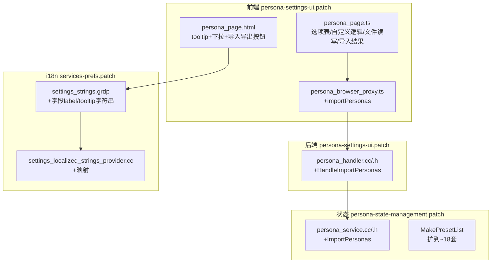

# PERSONA 易用性增强 — 完整实施计划

## 一句话目标

让 PERSONA 支持**导入/导出**、**多套参数集自管理**，给**每个配置项加多语言解释 + 问号图标**，常用参数给**下拉候选 + 自定义输入**，并把预设从 6 套扩到覆盖**亚洲/欧洲/美洲/大洋洲**主流地区。一次性完整交付。

---

## 已确认的决策

| # | 决策 |
|---|------|
| 1 | tooltip/label **多覆盖主流语言**（en / zh-CN / zh-TW / ja / ko / de / fr / es / pt-BR / ru），未覆盖语言回退英文，用户可自行填写 |
| 2 | 预设覆盖**亚洲/欧洲/美洲/大洋洲**主流地区 + 平台组合（约 18 套） |
| 3 | 导入时始终分配新 id；同名时才给**名字后追加时间戳**（不覆盖已有） |
| 4 | 导出**排除系统 default** |
| 5 | **一次性完整交付**（非分批） |

---

## 现状（已核对代码）

| 部分 | 现状 | 文件 |
|------|------|------|
| 设置页 UI | Polymer 子页：Profiles / Startup / Quick Presets / Edit Profile 四段；表单多为纯文本 `cr-input`，全英文无 tooltip | `persona-settings-ui.patch` → `persona_page.html` / `persona_page.ts` |
| 前端代理 | `persona_browser_proxy.ts`：get/save/create/delete/clone/activate/launchMode/refresh | 同上 |
| C++ handler | `persona_handler.cc/.h`：注册消息回调转发给 `PersonaService` | 同上 |
| 数据模型 + 预设 | `MakePreset()`/`MakePresetList()`（**6 套**）、`SavePersona`/`ValidatePersona`/`NormalizePersona`/`UpsertPersona` | `persona-state-management.patch` |
| i18n | 仅 `IDS_SETTINGS_PERSONA_TITLE` / `_DESCRIPTION` 两条 | `services-prefs.patch` → `settings_strings.grdp` + `settings_localized_strings_provider.cc` |
| 校验守卫 | `_PERSONA_SETTINGS_MANUAL_FIELD_GROUPS` 强制 UI patch 保留一批 `editablePersona_.*` 绑定 | `devutils/check_patch_files.py` |

### 硬约束

- **守卫 token 不可丢**：`_PERSONA_SETTINGS_MANUAL_FIELD_GROUPS` 里列出的 `editablePersona_.*`（userAgent / platform / navigatorVendor / navigatorProductSub / uaCh.platform / uaCh.fullVersion / region.* / gpu.* / hardware.* / screen.* / fonts.id / fontRendering.engine / mediaDevices.audioBaseLatency / network.* 以及 `uaChBrandsText_` 等文本聚合字段）必须继续出现在 `persona-settings-ui.patch`。表单可以从 `cr-input` 换成 select+custom，但**绑定路径不变**。
- **组件可用性**：桌面端可用 `ui/webui/resources/cr_elements/policy/cr_tooltip_icon.ts`（问号 tooltip）。`cr_searchable_drop_down` 仅 ash/ChromeOS，桌面不可用 → 自定义下拉用原生 `<select>` + "自定义…" 选项 + 条件 `cr-input`。
- **改 patch 必须走 quilt**（AGENTS.md）：在 `codex_tmp/patchwork_src` 编辑源码 → `./devutils/quilt-fix.sh <patch>` 刷新，禁止手改 diff hunk。
- **i18n 翻译落地**：Helium 自定义字符串通过 `settings_strings.grdp` 的 `<message>` 承载。多语言翻译走项目现有 i18n 流程（grit / .xtb）。**关键**：新增字符串必须同步进 `devutils/validate_config.py` 覆盖的 i18n 校验，避免漏项。
- **构建**：patch + cheap/source 验证后，用本仓库 `platform/macos` 跑 `he *`。

---

## 实施设计（4 个模块，一次交付）

### 模块 1 — 扩充预设（改 `persona-state-management.patch`）

在 `MakePresetList()` 从 6 套扩到 **约 18 套**，每套内部自洽（UA / 平台 / 时区 / locale / accept-language / GPU / 屏幕 / 字体 id 一致）。候选地区/平台：

| 区域 | 预设 |
|------|------|
| 美洲 | US West (macOS)、US East (Windows)、Canada (Windows)、Brazil (Windows)、Mexico (Windows) |
| 欧洲 | UK (Windows)、Germany (Linux)、France (macOS)、Netherlands (Windows)、Spain (Windows)、Italy (Windows)、Russia (Windows) |
| 亚洲 | Japan (macOS)、Singapore (macOS)、South Korea (Windows)、India (Windows)、Hong Kong (macOS) |
| 大洋洲 | Australia (Windows) |

- 实现前先出**预设候选表**（每套的 UA/时区/locale/accept-language/GPU renderer/屏幕/DPR），联网用 web/Context7 核对**当前 Chrome 稳定版 UA** 和常见 GPU renderer 字符串，保证可信。
- 复用现有 `MakePreset(...)` 签名，只追加 `presets.Append(...)` 条目。风险最低。

### 模块 2 — 多语言解释 + 问号图标（改 `persona-settings-ui.patch` + i18n）

- 引入 `cr-tooltip-icon`，每个字段结构统一为：`本地化 label` + 问号图标（悬停出 tooltip，讲清"这参数是什么、影响哪个 JS/HTTP 指纹面"）。
- 新增一批 i18n 键 `IDS_SETTINGS_PERSONA_FIELD_<NAME>_LABEL` / `_TOOLTIP`，覆盖所有可编辑字段。
- 翻译落地 **en / zh-CN / zh-TW / ja / ko / de / fr / es / pt-BR / ru**，其余语言由 grit 回退英文。
- `settings_localized_strings_provider.cc` 的 `AddPrivacyStrings` 增加对应 `{"personaFieldXxxLabel", IDS_...}` 映射。

### 模块 3 — 常用参数：下拉候选 + 自定义输入（改 `persona-settings-ui.patch`）

- 常用字段改"下拉 + 自定义…"模式，选到"自定义…"时显示旁边 `cr-input` 手填：
  - `region.timezone`：常见时区 + 自定义
  - `region.locale`：常见 locale + 自定义（联动生成 acceptLanguage，保留手填）
  - `platform` / `uaCh.platform`：macOS/Windows/Linux/Chrome OS/Android + 自定义
  - `gpu.vendor` / `gpu.renderer`：Apple/Intel/AMD/NVIDIA 常见组合 + 自定义
  - `network.type`：wifi/ethernet/cellular/none + 自定义
  - `hardware.hardwareConcurrency` / `hardware.deviceMemory`：常见档位 + 自定义
- 候选列表集中放一个 TS 常量表（`persona_field_options.ts` 或 `persona_page.ts` 顶部常量）便于维护。
- **守卫 token 全部保留**：每个 select/custom 的双向绑定仍指向原 `editablePersona_.*` 路径。

### 模块 4 — 导入 / 导出（改 UI + proxy + handler + service 四层）

**导出**
- Edit Profile 段：`导出此配置` → 导出当前 profile 单套 JSON。
- Profiles 段：`全部导出` → 导出所有非 default profile 的 bundle。
- 格式带版本头：
  ```json
  { "schema": "helium.persona/v1", "exportedAt": "<iso>", "personas": [ /* 完整 persona，排除 default */ ] }
  ```
- 前端用 `Blob` + `URL.createObjectURL` 触发下载，无需新增 C++ 下载通道。

**导入**
- Profiles 段：`导入` → 隐藏 `<input type="file" accept=".json">`，读文件 → parse → 调后端。
- 新增后端 `ImportPersonas(const base::Value::List&)`：
  - 每条复用 `ValidatePersona` + `NormalizePersona`，分配**新 id**。
  - **冲突处理（已确认）**：若 displayName 与现有 profile 重名 → 名字追加时间戳后缀（如 `Tokyo macOS 20260702-000102`）后导入，不覆盖。
  - 逐条校验失败则跳过该条并计数，不整批失败。
  - 返回 `{ ok, state, fieldErrors, importedCount, skippedCount }`。
- UI 显示导入结果（成功 N 条 / 跳过 M 条）。

**四层改动**
- `persona_browser_proxy.ts`：+ `importPersonas(payload): Promise<PersonaImportResponse>`
- `persona_handler.cc/.h`：+ `HandleImportPersonas`（校验 args[1] 为 list/dict，转发 service）
- `persona_service.cc/.h`：+ `ImportPersonas(...)`（冲突加时间戳、重分配 id、逐条 normalize）
- `persona_page.html/.ts`：+ 导入/导出按钮、file input、下载逻辑、结果提示

---

## 涉及文件汇总



> 注：`importPersonas` 的 handler 归属 `persona-settings-ui.patch`（handler 定义在此），`ImportPersonas` service 逻辑归属 `persona-state-management.patch`。i18n 字符串归 `services-prefs.patch`（现有 persona 字符串就在这）。改动前会确认这三个 patch 在 series 中的相对顺序，避免跨 patch 覆盖冲突。

---

## 执行步骤（严格遵循 AGENTS.md quilt 流程）

1. **前置检查主验证树干净**
   ```bash
   python3 devutils/check_chromium_src_clean.py --source-tree chromium_src
   ```
2. **建独立 quilt 开发树**
   ```bash
   rm -rf codex_tmp/patchwork_src
   python3 ./utils/downloads.py unpack -i downloads.ini -c chromium_download_cache codex_tmp/patchwork_src
   source devutils/set_quilt_vars.sh   # 确认指向 patchwork_src
   ```
3. **按 series 顺序 push 到目标 patch，在源码树编辑**（先出预设候选表→确认→再落 C++；然后依次做 service 导入、handler、i18n、UI）
4. **刷新 patch**
   ```bash
   ./devutils/quilt-fix.sh persona-state-management.patch
   ./devutils/quilt-fix.sh persona-settings-ui.patch
   ./devutils/quilt-fix.sh services-prefs.patch
   ```
5. **清理开发树**
   ```bash
   quilt pop -a || true
   find codex_tmp/patchwork_src -name '*.orig' -delete
   rm -rf codex_tmp/patchwork_src/.pc
   ```

## 验证计划

```bash
# 1. 若动 devutils
python -m yapf --style .style.yapf -e '*/third_party/*' -rpd devutils

# 2. 收尾验证（含 persona 守卫 + i18n 校验）
python3 .codex/skills/nitrous-validate/scripts/run_validation.py

# 3. patch 正确性（fresh source）
rm -rf codex_tmp/patchcheck_src
python3 ./utils/downloads.py unpack -i downloads.ini -c chromium_download_cache codex_tmp/patchcheck_src
python3 devutils/check_chromium_src_clean.py --source-tree codex_tmp/patchcheck_src
./devutils/validate_patches.py -l codex_tmp/patchcheck_src -v

# 4. source-backed（跨模块，必跑）
python3 .codex/skills/nitrous-validate/scripts/run_validation.py --with-source --source-tree chromium_src

# 5. 影响面大，加 full
python3 .codex/skills/nitrous-validate/scripts/run_validation.py --full
```

- **必确认** `check_persona_settings_manual_field_coverage` 通过（守卫 token 未丢）。
- 编译期用 `devutils/syntax_check.py`（秒级）+ `devutils/build_targets.py`（分钟级）在 `build/src` 热树预检 C++/handler；**迭代期不每轮 `he merge && he push`**。
- 全部 cheap/source 验证通过后，`source platform/macos/build.sh` 再 `he presetup / merge / push / configure / build`（或 `he auto-package`）。

## 交付物

- 3 个更新的 patch：`persona-state-management.patch`、`persona-settings-ui.patch`、`services-prefs.patch`
- 一份预设候选表（实现前先给你确认）
- 验证日志（cheap + source-backed；如本地无法跑到某步会明确说明阻塞原因）

## 风险与回退

| 风险 | 应对 |
|------|------|
| 表单重构误删守卫 token → 验证 fail | 改前列出全部守卫 token，改后 grep 逐一确认 |
| 预设 UA/GPU 字符串不真实 → 指纹可疑 | 联网核对当前 Chrome 稳定版 UA + 常见 GPU renderer，候选表先确认 |
| 多语言字符串漏项/格式错 → i18n 校验 fail | 集中新增、run_validation 覆盖，缺失语言回退英文 |
| 跨 patch hunk 冲突 | 先查 series 顺序，按序 quilt push，逐个 quilt-fix |
| 导入恶意/畸形 JSON | 全部走 `ValidatePersona`，畸形条目跳过计数，不写入 |
```
