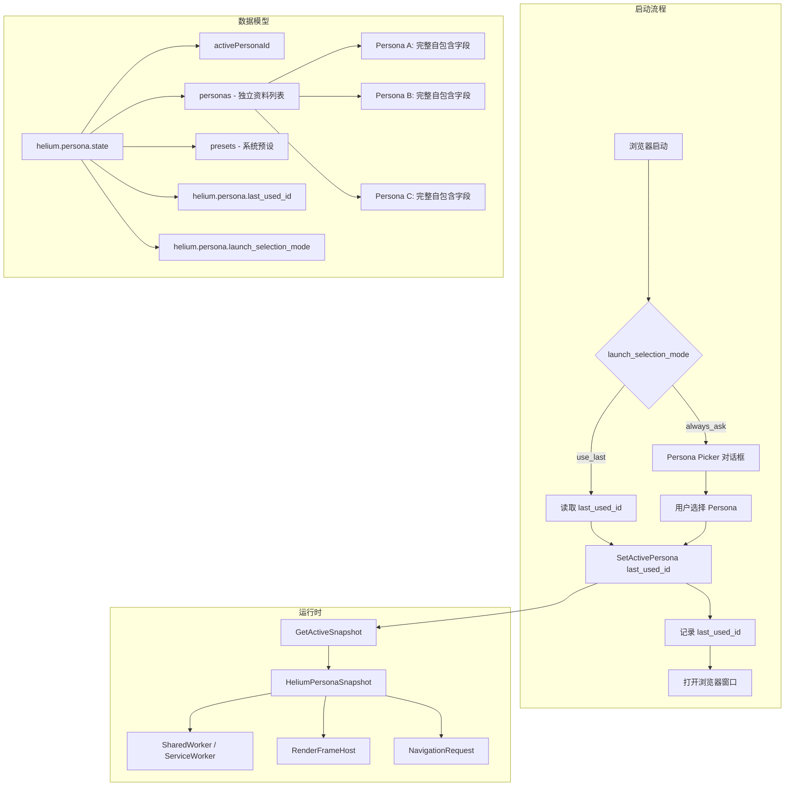
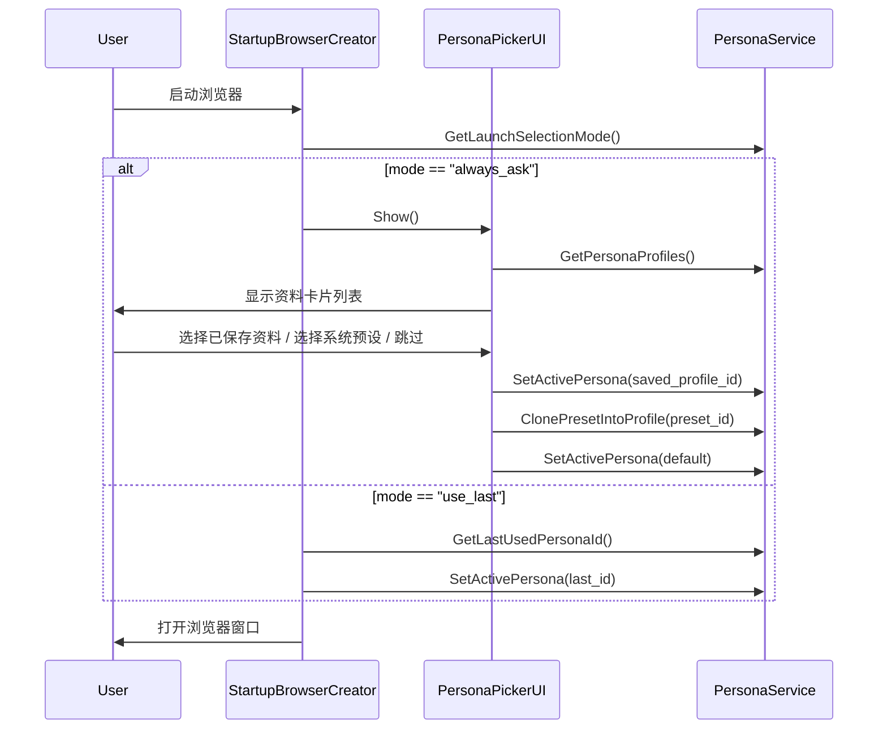
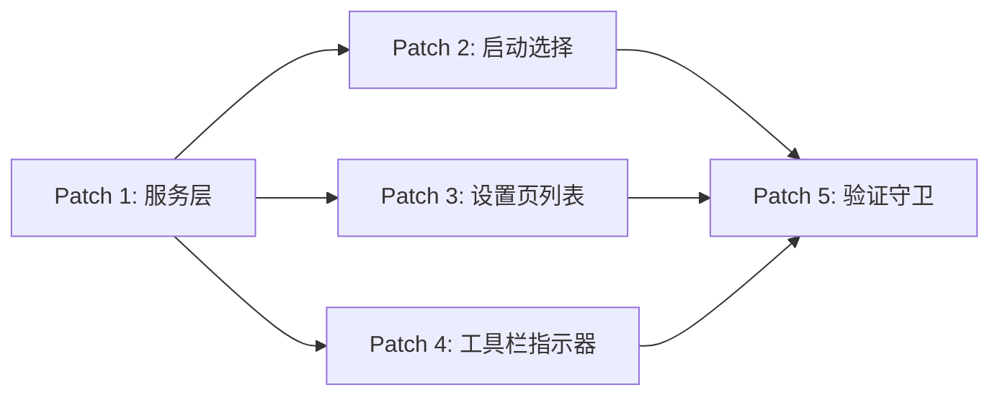

# Persona 个人资料管理：启动时选择 + 独立保存 + 隔离

## 背景与现状

当前 Persona 系统已有以下能力：

| 能力 | 实现位置 | 状态 |
|------|---------|------|
| 系统预设（6 套） | `persona-state-management.patch` → `MakePresetList()` | ✅ 已有 |
| 手动保存自定义 Persona | `SavePersona()` | ✅ 已有 |
| 从预设克隆到个人资料 | `ClonePresetIntoProfile()` | ✅ 已有 |
| 切换活跃 Persona | `SetActivePersona()` | ✅ 已有 |
| 删除 Persona | `DeletePersona()` | ✅ 已有 |
| 运行时 Snapshot 传播 | `GetHeliumPersonaSnapshot(browser_context)` | ✅ 已有 |
| 设置页手动编辑 | `persona-settings-ui.patch` | ✅ 已有 |

**本计划已落地的关键能力：**

1. ✅ **启动时选择** — 浏览器启动时可显示 Persona 选择界面，并支持已保存资料、系统预设和默认 Persona
2. ✅ **资料元数据** — Persona 持久化包含 `displayName`、`icon`、`createdAt`、`lastUsedAt` 等辨识信息
3. ✅ **上次使用记忆** — 切换、创建、保存和从预设克隆后都会同步更新最近使用资料
4. ✅ **启动选择模式** — 支持 `"always_ask"` / `"use_last"` 启动偏好
5. ✅ **资料列表管理 UI** — 设置页支持多资料列表、卡片选择、创建、克隆、删除和激活
6. ✅ **工具栏指示器** — 浏览过程中可通过工具栏查看当前 Persona 并快速切换

## 目标架构



## 实施计划

### Patch 1: `persona-state-management.patch`（服务层增强，合并到现有 Patch）

**目标：** 为每个 Persona 增加元数据，新增启动选择相关 Pref 和 Service 方法。

**修改文件：**

| 文件 | 改动 |
|------|------|
| `chrome/browser/helium_persona/persona_service.h` | 新增公开方法声明 |
| `chrome/browser/helium_persona/persona_service.cc` | 实现新方法 + 扩展 NormalizePersona |
| `chrome/browser/prefs/browser_prefs.cc` | 注册新 Pref |

**具体改动：**

1. **Persona 元数据扩展** — 在 `NormalizePersona()` 中确保每个 Persona 包含：
   ```
   displayName  — 用户可编辑的显示名称（区别于内部 name）
   icon         — 图标标识符（如 "macos"、"windows"、"linux"）
   createdAt    — 创建时间戳（ISO 8601 字符串）
   modifiedAt   — 最后修改时间戳
   lastUsedAt   — 最后使用时间戳
   ```

2. **新 Pref 注册：**
   - `helium.persona.last_used_id` (string) — 上次使用的 Persona ID
   - `helium.persona.launch_selection_mode` (string) — `"always_ask"` | `"use_last"`

3. **新 Service 方法：**
   ```cpp
   // 返回所有已保存 Persona（含元数据），供 Picker / 列表 UI 使用
   base::DictValue GetPersonaProfiles() const;

   // 创建一个新的空白 Persona 资料，返回完整状态
   base::DictValue CreatePersonaProfile(const std::string& display_name);

   // 读取/设置上次使用的 Persona ID
   std::string GetLastUsedPersonaId() const;
   void SetLastUsedPersonaId(const std::string& persona_id);

   // 读取/设置启动选择模式
   std::string GetLaunchSelectionMode() const;
   void SetLaunchSelectionMode(const std::string& mode);
   ```

4. **SetActivePersona 增强** — 切换时自动更新 `lastUsedAt` 和 `helium.persona.last_used_id`

5. **独立保存保证** — `SavePersona()` 和 `ClonePresetIntoProfile()` 确保每个 Persona 是完整的自包含字典，不共享引用

---

### Patch 2: `persona-launch-picker.patch`（启动时选择 UI）

**目标：** 浏览器启动时弹出 Persona 选择对话框，用户可选择本次会话使用的 Persona。

**新增文件：**

| 文件 | 说明 |
|------|------|
| `chrome/browser/ui/webui/persona_picker/persona_picker_ui.cc` | WebUI 控制器 |
| `chrome/browser/ui/webui/persona_picker/persona_picker_ui.h` | 头文件 |
| `chrome/browser/resources/persona_picker/persona_picker.html` | 选择器页面 |
| `chrome/browser/resources/persona_picker/persona_picker.ts` | 交互逻辑 |
| `chrome/browser/resources/persona_picker/persona_picker_browser_proxy.ts` | 浏览器代理 |

**修改文件：**

| 文件 | 改动 |
|------|------|
| `chrome/browser/ui/startup/startup_browser_creator.cc` | 在首个窗口创建前插入 Picker 调用 |
| `chrome/browser/ui/BUILD.gn` | 添加新文件 |
| `chrome/browser/resources/BUILD.gn` | 添加新资源 |

**启动流程：**



**Picker UI 特性：**
- 卡片列表展示所有已保存 Persona + 系统预设
- 每张卡片显示：displayName、icon、platform/region 摘要、lastUsedAt
- 选择已保存资料时 → 调用 `SetActivePersona` + 关闭 Picker
- 选择系统预设时 → 调用 `ClonePresetIntoProfile`，生成本次会话使用的真实资料后关闭 Picker
- "跳过（使用默认）" 按钮 → 显式切回默认 Persona，再关闭 Picker
- "记住选择" 复选框 → 设置 `launch_selection_mode = "use_last"`
- 高亮上次使用的 Persona

---

### Patch 3: `persona-settings-ui.patch`（设置页资料管理，合并到现有 Patch）

**目标：** 将设置页从单 Persona 编辑表单升级为多资料列表 + 详情编辑视图。

**修改文件：**

| 文件 | 改动 |
|------|------|
| `chrome/browser/resources/settings/privacy_page/persona_page.html` | 新增资料列表/卡片视图 |
| `chrome/browser/resources/settings/privacy_page/persona_page.ts` | 新增列表交互逻辑 |
| `chrome/browser/resources/settings/privacy_page/persona_browser_proxy.ts` | 新增 `getPersonaProfiles` / `createPersonaProfile` 代理方法 |
| `chrome/browser/ui/webui/settings/persona_handler.cc` | 新增 handler 方法 |
| `chrome/browser/ui/webui/settings/persona_handler.h` | 新增 handler 声明 |

**UI 布局：**

```
┌─────────────────────────────────────────┐
│  Persona 个人资料                        │
├─────────────────────────────────────────┤
│  ┌─────────┐ ┌─────────┐ ┌─────────┐   │
│  │ 资料 A   │ │ 资料 B   │ │ 资料 C   │   │
│  │ macOS    │ │ Windows  │ │ Linux    │   │
│  │ US-West  │ │ UK       │ │ Germany  │   │
│  │ ● 活跃   │ │ 编辑/删除 │ │ 编辑/删除 │   │
│  └─────────┘ └─────────┘ └─────────┘   │
│  [+ 新建资料]  [从预设克隆]              │
├─────────────────────────────────────────┤
│  ▼ 编辑：资料 A                          │
│  Quick Presets | 手动字段表单 | Save     │
└─────────────────────────────────────────┘
```

**新增交互：**
- 资料卡片网格：展示所有 `personas[]`，每张卡片含 displayName、icon、platform 摘要、活跃指示器
- "新建资料"按钮 → 调用 `createPersonaProfile` → 切换到编辑视图
- "从预设克隆"按钮 → 保留现有 Quick Presets 下拉
- 卡片点击 → 切换到该资料的编辑视图（加载对应 editablePersona_）
- "设为活跃"按钮 → 调用 `setActivePersona` → 更新活跃指示器
- 启动选择模式设置：下拉选择 "always_ask" / "use_last"

---

### Patch 4: `persona-session-indicator.patch`（工具栏指示器）

**目标：** 在工具栏显示当前活跃 Persona，支持快速切换。

**新增文件：**

| 文件 | 说明 |
|------|------|
| `chrome/browser/ui/views/persona/persona_indicator_button.cc` | 工具栏按钮 |
| `chrome/browser/ui/views/persona/persona_indicator_button.h` | 头文件 |
| `chrome/browser/ui/views/persona/persona_indicator_menu_model.cc` | 快速切换菜单 |
| `chrome/browser/ui/views/persona/persona_indicator_menu_model.h` | 菜单模型 |

**修改文件：**

| 文件 | 改动 |
|------|------|
| `chrome/browser/ui/views/toolbar/toolbar_view.cc` | 添加 Persona 指示器按钮 |
| `chrome/browser/ui/views/toolbar/toolbar_view.h` | 声明成员 |
| `chrome/browser/ui/view_ids.h` | 新增 VIEW_ID_PERSONA_INDICATOR |

**按钮行为：**
- 显示当前活跃 Persona 的 icon + 简称
- 点击弹出菜单：列出所有已保存 Persona，高亮当前活跃项
- 选择菜单项 → 调用 `SetActivePersona` → 刷新所有渲染进程
- Persona 未启用时显示灰色"默认"图标

---

### Patch 5: 验证守卫更新（`devutils/check_patch_files.py`）

**目标：** 为新增功能添加覆盖守卫，确保 token 不被意外移除。

**新增守卫组：**

```python
_PERSONA_PROFILE_MANAGEMENT_GROUPS = {
    'profile metadata and lifecycle': (
        'GetPersonaProfiles',
        'CreatePersonaProfile',
        'GetLastUsedPersonaId',
        'SetLastUsedPersonaId',
        'GetLaunchSelectionMode',
        'SetLaunchSelectionMode',
        'helium.persona.last_used_id',
        'helium.persona.launch_selection_mode',
    ),
    'launch picker entrypoint': (
        'persona_picker_ui',
        'PersonaPickerUI',
        'GetPersonaProfiles',
        'SetActivePersona',
        'launch_selection_mode',
    ),
    'profile manager UI': (
        'persona-profile-manager',
        'createPersonaProfile',
        'getPersonaProfiles',
        'ProfileCard',
        'onProfileCardClick_',
        'onCreateProfileClick_',
    ),
    'session indicator': (
        'PersonaIndicatorButton',
        'persona_indicator',
        'VIEW_ID_PERSONA_INDICATOR',
    ),
}
```

**新增检查函数：**

```python
def check_persona_profile_management_coverage(patches_dir, series_path=Path('series')):
    """Check that persona profile management features are covered."""
    return _check_persona_token_groups(
        patches_dir, 'profile management',
        _PERSONA_PROFILE_MANAGEMENT_GROUPS, series_path)
```

**在 `validate_config.py` 中注册调用。**

---

## 补丁顺序（`patches/series`）

```
helium/core/persona-state-management.patch          # 现有，承载 Patch 1 服务层增强
helium/core/persona-settings-ui.patch               # 现有，承载 Patch 3 设置页资料管理
helium/core/persona-launch-picker.patch             # 新增 — 启动选择
helium/core/persona-session-indicator.patch         # 新增 — 工具栏指示器
helium/core/persona-consistent-randomize-ui.patch   # 现有
...
```

## 验证流程

每个 Patch 完成后按 AGENTS.md 标准流程验证：

1. **主验证树干净检查：**
   ```bash
   python3 devutils/check_chromium_src_clean.py --source-tree chromium_src
   ```

2. **Fresh source patch apply 验证：**
   ```bash
   rm -rf codex_tmp/patchcheck_src
   python3 ./utils/downloads.py unpack -i downloads.ini -c chromium_download_cache codex_tmp/patchcheck_src
   ./devutils/validate_patches.py -l codex_tmp/patchcheck_src -v
   ```

3. **项目 skill 验证：**
   ```bash
   python3 .codex/skills/helium-validate/scripts/run_validation.py
   ```

4. **跨模块验证（影响面广）：**
   ```bash
   python3 .codex/skills/helium-validate/scripts/run_validation.py --full
   ```

5. **单元测试：**
   ```bash
   cd devutils && python3 -m pytest tests/test_check_patch_files.py -v
   ```

## 依赖关系



- **Patch 1 是基础**，必须先完成
- **Patch 2/3/4 互相独立**，可并行开发
- **Patch 5 最后完成**，汇总所有新增 token

## 风险与注意事项

1. **启动性能** — Picker 对话框会在首个窗口前显示，需确保 `GetPersonaProfiles()` 快速返回（直接读 Pref，无 IO）
2. **Snapshot 刷新** — `SetActivePersona` 后需要确保所有已打开的渲染进程获取新 Snapshot；当前架构在 worker 创建时读取，已打开的页面可能需要刷新
3. **Pref 迁移** — 现有 `personas[]` 中的 Persona 缺少元数据字段，`NormalizePersona()` 需向后兼容地补全
