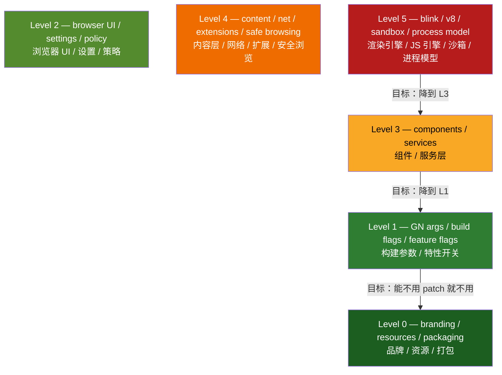
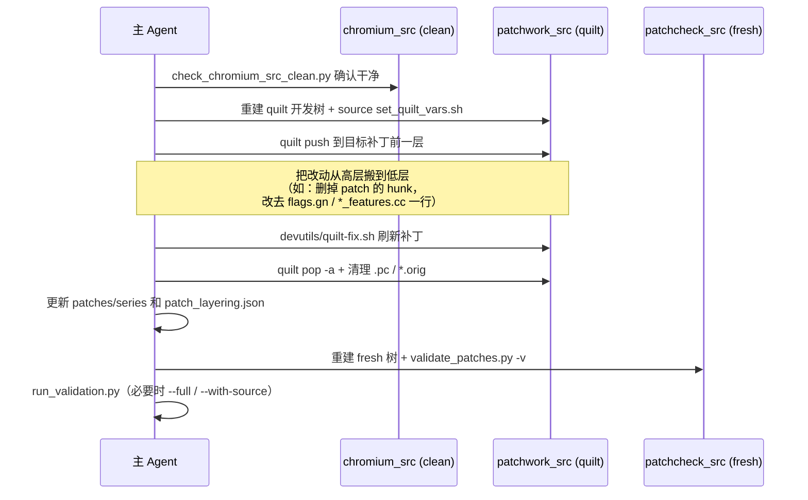

# PATCH 降级方案：补丁分层审计（Patch Layering Audit）

## 一、问题与目标

### 核心论点：把 PATCH 从"手段"降级为"类别"

当前 Helium 的 164 个补丁里，相当一部分本质上只是"改了一个默认值 / 开了一个开关 / 换了一个字符串"，却用源码 diff 的方式实现。这类补丁的代价是：

- 每次跟随上游 Chromium 升级时，diff 容易因为周边代码变动而 `hunk failed`，需要人工 refresh。
- 越是动 `blink` / `v8` / `content` / `net` 这类高频变动区域，升级时越像"拆炸弹"。
- 同样一个意图（比如"默认开启 HTTPS-First"），用 patch 实现 vs 用 GN flag / feature flag / pref 实现，维护成本相差一个数量级。

**目标不是"消灭补丁"**，而是把"打补丁"从默认手段降级成最后手段。判断准则只有三条：

1. **能从 Level 5 降到 Level 3 就降**（别去动 blink/v8/sandbox，改去动 service/component 层）
2. **能从 Level 3 降到 Level 1 就降**（别去改 service 逻辑，改去翻 GN arg / feature flag / pref）
3. **能不用 patch 就不用 patch**（能用配置、能用 component、能用 policy，就不写 diff）

最终状态：**多数地方只是换配置，少数地方才打补丁。** 升级时绝大部分改动落在低层（配置文件、flags.gn），高层补丁数量可控、每个都有明确的"为什么必须是补丁"的理由。

### 分层模型（Level 0 → Level 5，按升级脆弱度递增）



> 越往下（L5）越靠近高频变动、强耦合的引擎核心，升级时最容易碎；越往上（L0/L1）越接近"配置"，升级时几乎不碎。**降级 = 把一个改动从脆弱层搬到稳定层。**

---

## 二、这套审计要交付什么

本方案分两个阶段，**第一阶段是纯审计（只读、产出报告），第二阶段才是按报告逐个降级（改补丁）**。

- **阶段 A — 审计与分级**：给 164 个补丁逐个打上 `level` 标签，标注每个补丁的"降级潜力"和"降级路径"，产出一份可排序、可追踪的清单。这一阶段不改任何补丁，纯产出数据 + 报告。
- **阶段 B — 降级执行**：按报告里"高收益 / 低风险"优先级，分批把补丁往下层搬，每搬一个走一遍完整验证流程。

> 因为当前是 **Explore 模式**，本文件只覆盖到"方案"层面。阶段 A 的脚本编写与运行、阶段 B 的补丁改写，都需要切到 Ask/Execute 模式后执行；届时通过 `SubmitPlan` 提交。

---

## 三、阶段 A：审计与分级

### A1. 建立分级元数据来源

每个补丁需要一个稳定的 `level` 与 `demotion`（降级潜力）标注。两种落地方式，建议二选一或组合：

| 方式 | 落地位置 | 优点 | 缺点 |
|------|---------|------|------|
| **A. patch 头部注释** | 每个 `.patch` 文件顶部加 `# helium-level: N` / `# helium-demotion: ...` | 和补丁同生命周期、不会漂移 | 要碰 164 个文件头（不碰 hunk，安全） |
| **B. 独立清单文件** | 新增 `devutils/patch_layering.json`（slug → level/kind/reason） | 集中、好审阅、好做报表 | 与 series 同步要靠脚本守卫 |

**推荐：以 B（独立清单）为 source of truth，脚本校验它和 `patches/series` 完全对齐**（无遗漏、无多余、无未分级）。清单初稿由审计脚本根据"补丁触碰的文件路径"自动推断 level，人工复核后定稿。

### A2. 自动分级规则（按补丁触碰的文件路径推断 level）

审计脚本解析每个补丁的 `+++ b/<path>`，按下表把路径映射到 level，再取该补丁所有 hunk 中的**最高 level**作为补丁 level（最脆弱的那一层决定整体脆弱度）。

| Level | 路径特征（示例，正则/前缀匹配） |
|-------|-------------------------------|
| **L0** | `chrome/app/theme/`、`*resources*`、`*.grd`/`*.grdp`、`*-Info.plist`、`chrome/app/.../branding`、图标/打包脚本 |
| **L1** | `flags.gn`、`*.gn`/`*.gni` 中的 build args、`*_features.cc`/`*_features.h`（`base::Feature` 默认值）、`about_flags.cc` |
| **L2** | `chrome/browser/ui/`、`chrome/browser/resources/settings/`、`components/policy/`、`*prefs*.cc`（默认 pref 值） |
| **L3** | `components/`（非 policy/bookmarks-utils 之类纯数据）、`chrome/browser/<service>/`、`services/` |
| **L4** | `content/`、`net/`、`extensions/`、`components/safe_browsing/`、`google_apis/` |
| **L5** | `third_party/blink/`、`v8/`、`sandbox/`、`content/.../renderer/`、进程模型相关 |

> 多文件补丁（如 `persona-state-management.patch` 同时碰 `content/public/`、`third_party/blink/`、`chrome/browser/helium_persona/`）会被判为 **L5**，符合"它确实是最难升级的那一类"的直觉。

### A3. 降级潜力评估（每个补丁打三个字段）

| 字段 | 取值 | 含义 |
|------|------|------|
| `current_level` | 0–5 | 自动推断 + 人工复核 |
| `target_level` | 0–5 | 理论上可降到的最低层（人工判断） |
| `demotion_kind` | 见下表 | 降级手段类型 |

`demotion_kind` 取值：

| 取值 | 含义 | 典型例子 |
|------|------|---------|
| `to-gn-flag` | 改成 `flags.gn` 里的 GN arg | 现已用 patch 改的某些 `enable_xxx` |
| `to-feature-flag` | 改成 `base::Feature` 默认值翻转（理想情况下走 `fieldtrial_testing` 或 `--enable-features`，否则仍是改 `*_features.cc` 但只动一行） | `prefer-https-by-default`（碰 `chrome_features.cc`） |
| `to-pref-default` | 改成默认 pref 值（`modify-default-prefs.patch` 风格集中管理） | `disable-bookmarks-bar`、`memory-saving-by-default` 候选 |
| `to-policy` | 改成 enterprise policy 默认/锁定 | 部分隐私/更新相关开关 |
| `to-component` | 改成 component（按需下发，不进二进制） | `ublock-install-as-component` 已是范本 |
| `to-resource` | 改成纯资源/品牌覆盖 | 图标、字符串、主题 |
| `keep-as-patch` | 无法降级，必须是补丁 | 注入新 mojom 接口、改进程模型、persona 引擎钩子 |
| `merge-candidate` | 多个小补丁可合并进一个集中补丁，减少 hunk 数量 | 多个 `modify-default-prefs` 候选 |

### A4. 审计脚本（阶段 A 的产物）

新增 `devutils/audit_patch_layering.py`，遵循现有 devutils 风格（复用 `parse_series`、`unidiff`、`get_logger`）：

```text
功能：
  1. 读取 patches/series，逐个解析补丁触碰的文件路径
  2. 按 A2 规则推断 current_level
  3. 与 devutils/patch_layering.json 对照：
       - 缺分级 → 报警
       - series 有但 yaml 没有 / yaml 有但 series 没有 → 报警
  4. 输出报表（stdout + 可选 JSON/CSV）：
       slug | dir | current_level | target_level | demotion_kind | files_touched | hunk_count
  5. 统计：各 level 补丁数量、可降级补丁数量、预计减少的高层 hunk 数
```

**集成点**（参考现有 `validate_config.py` 注册 `check_*` 的方式）：

- `audit_patch_layering.py` 提供 `check_patch_layering_coverage(patches_dir)`，在 `validate_config.py` 的 `main()` 中追加一行 `warnings |= check_patch_layering_coverage(patches_dir)`，确保"新增补丁必须分级"成为硬约束。
- 纯报表模式（不影响 CI 退出码）通过 `--report` 开关单独运行。
- 按 AGENTS.md 要求，改 `devutils` 后跑：
  ```bash
  python -m yapf --style .style.yapf -e '*/third_party/*' -rpd devutils
  python3 .codex/skills/helium-validate/scripts/run_validation.py
  ```

### A5. 阶段 A 产出报告（给人看的）

审计脚本跑完后，生成一份 Markdown 报告（写到 `plans/` 或仓库 docs），包含：

1. **分层全景**：164 个补丁的 level 分布柱状图（数据来自脚本统计）。
2. **降级候选清单**：所有 `current_level > target_level` 的补丁，按"降级收益（跨层数 × hunk 数）"排序。
3. **必须保留清单**：`keep-as-patch` 的补丁，逐个写明"为什么不能降"。
4. **合并候选**：`merge-candidate` 分组。

---

## 四、阶段 B：降级执行（按报告逐批改补丁）

### B1. 批次划分原则

按"风险从低到高、收益从高到低"排序，分批做。**每批只动一组互不重叠的补丁**（AGENTS.md 要求：不要让多个改动重叠覆盖同一段代码）。

| 批次 | 内容 | 风险 | 说明 |
|------|------|------|------|
| **B-1** | `to-gn-flag` / `to-resource` 候选 | 最低 | 纯配置/资源迁移，几乎不碰逻辑 |
| **B-2** | `to-pref-default` 候选合并进 `modify-default-prefs.patch` 风格 | 低 | 把散落的"改默认值"补丁集中到一处 |
| **B-3** | `to-feature-flag` 候选 | 中 | 翻转 `base::Feature` 默认值，单行改动优先 |
| **B-4** | `to-component` / `to-policy` 候选 | 中高 | 需要验证下发/策略链路 |
| **B-5** | 复核 `keep-as-patch`，尽量把 L5 降到 L3 | 高 | persona 引擎类，谨慎处理 |

### B2. 单个补丁降级的标准动作（每个都走一遍）



**关键纪律（全部来自 AGENTS.md）：**

- 不在 `chromium_src` 上做实验，它只做 clean baseline。
- 不手改 patch 的 diff 代码块（除非只动注释/元信息），所有源码改动经 quilt 走。
- 不在污染树上硬推 patch；状态不一致先重建源码树。
- 降级若涉及删除整个补丁：从 `patches/series` 移除 + 从 `patch_layering.json` 移除 + 确认无 orphan。
- 降级若改成 `flags.gn`：注意 GN flags 必须排序、不重复（`check_gn_flags` 会校验）。
- macOS 侧（`helium-macos` 仓库的 `helium-chromium/patches/`）是当前补丁的镜像同步目标——降级后需要同步过去，但**最终打包/`he *` 流程只在 `helium-macos` 仓库做**，不在当前仓库起编译。

### B3. 验证门槛（每批交付前必过）

```bash
# 1. clean baseline
python3 devutils/check_chromium_src_clean.py --source-tree chromium_src

# 2. fresh source apply
rm -rf codex_tmp/patchcheck_src
python3 ./utils/downloads.py unpack -i downloads.ini -c chromium_download_cache codex_tmp/patchcheck_src
python3 devutils/check_chromium_src_clean.py --source-tree codex_tmp/patchcheck_src
./devutils/validate_patches.py -l codex_tmp/patchcheck_src -v

# 3. 项目 skill 验证（含 audit 守卫）
python3 .codex/skills/helium-validate/scripts/run_validation.py --with-source --source-tree chromium_src

# 4. 影响面大时
python3 .codex/skills/helium-validate/scripts/run_validation.py --full
```

---

## 五、初步分级预判（待脚本确认的人工速判，仅示意）

> 以下是基于补丁名 + 触碰文件的**人工初判**，真实 level 以阶段 A 脚本输出为准。

| 补丁 | 触碰文件（已抽样确认） | 初判 level | 降级潜力 |
|------|----------------------|-----------|---------|
| `prefer-https-by-default` | `chrome/common/chrome_features.cc` | L1 | 已经在 L1，确认是否可只动一行/或转 fieldtrial |
| `memory-saving-by-default` | `components/performance_manager/.../prefs.cc` | L2/L3 | `to-pref-default` 候选 |
| `disable-bookmarks-bar` | `components/bookmarks/browser/bookmark_utils.cc` | L3 | 评估能否转 `to-pref-default` |
| `app-isolation` | `chrome/app/app-Info.plist` | L0 | 已在 L0，保持 |
| `ublock-install-as-component` | components 下发 | L3→component | 已是 `to-component` 范本 |
| `persona-state-management` | `content/public/`、`third_party/blink/`、mojom | **L5** | `keep-as-patch`（注入新接口，无法降） |
| `change-chromium-branding` | branding 资源 | L0 | 保持 |
| `modify-default-prefs`（inox） | 默认 prefs | L2 | **集中收纳点**：其他 pref 候选往这里合并 |

可以看到 persona 引擎相关的几个补丁（`persona-state-management`、`persona-background-worker-snapshot-propagation`、`persona-privacy-sandbox-runtime-gates` 等）几乎注定是 `keep-as-patch` 的 L5——它们注入了新的 mojom 接口和跨进程 snapshot 传播，本来就是 Helium 的核心差异化能力，目标只是"控制数量 + 文档化为什么必须是补丁"，而不是降级。

真正的降级红利来自那一批"改默认值 / 翻开关 / 删 UI 入口"的补丁。

---

## 六、风险与注意事项

1. **降级 ≠ 行为不变**：把 patch 改成 feature flag/pref 默认值，要确认运行期行为完全等价（尤其 `base::Feature` 在不同 channel/平台默认值可能不同）。每个降级补丁都要在 fresh 树上验证行为。
2. **上游可能没有对应开关**：有些改动上游压根没暴露 GN arg / feature / pref，强行降级反而要写更多胶水代码——这种就老实标 `keep-as-patch`。
3. **macOS 镜像同步**：当前仓库改完补丁后，`helium-macos/helium-chromium/patches/` 需要同步；不要在当前仓库直接起 `he *`。
4. **守卫不能松**：persona 相关已有 `check_persona_*_coverage` token 守卫，降级/改写时不能误删被守卫的 token，否则 `validate_config.py` 会 fail。
5. **分级清单漂移**：`patch_layering.json` 必须靠脚本和 `patches/series` 强一致校验，否则新增补丁会绕过分级。

---

## 七、落地路线图


**第一步具体动作（切到执行模式后）：**

1. 编写 `devutils/audit_patch_layering.py` + 初始化 `devutils/patch_layering.json`。
2. 跑审计，生成分层报告（写到 `plans/` 或 docs）。
3. 与你一起复核报告，圈定 B-1 批次（最低风险）的具体补丁清单。
4. 把 B-1 批次作为独立的 `SubmitPlan` 提交后执行。

> 本文件是阶段 A 的**方案稿**。确认方向后，我会把"编写审计脚本 + 出报告"作为第一个可执行计划通过 `SubmitPlan` 提交。
