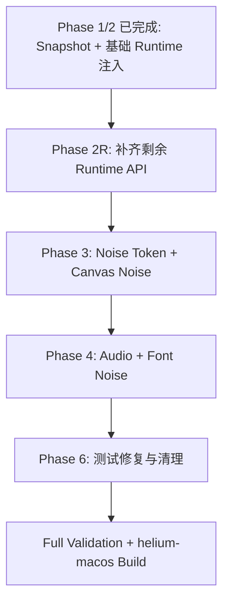

# Persona Runtime 补齐计划（审核版）

## 当前基线

已完成：

- `persona-state-management.patch`
  - 扩展 `HeliumPersonaSnapshot`。
  - `PersonaService::GetActiveSnapshot()` 已提取 platform / locale / language / GPU / hardware / screen / network / audio / noise 开关等字段。
- `persona-navigator-runtime-overrides.patch`
  - 已加入 `patches/series`。
  - 已把 snapshot 注入 `CommitNavigationParams` 并在 `RenderFrameImpl` 缓存。
  - 已覆盖：
    - `navigator.platform`
    - `navigator.hardwareConcurrency`
    - `navigator.languages`
    - `navigator.maxTouchPoints`
    - `screen.width`
    - `screen.height`
    - `screen.availWidth`
    - `screen.availHeight`
    - `screen.colorDepth`
    - `screen.pixelDepth`
- `persona-privacy-sandbox-runtime-gates.patch`
  - 已移除与新前置 runtime patch 冲突的重复 include/context。
- 已验证：cheap validation / source-backed validation / `validate_patches.py` 通过。

## 目标

补齐三类缺口：

1. **运行时 API 覆盖缺口**：已进入 snapshot 但尚未被 Blink runtime 消费的字段。
2. **Canvas / Audio / Font 噪声缺口**：UI 开关和 snapshot 字段存在，但无真实噪声实现。
3. **测试与验证缺口**：修复 noise token 测试依赖，跑完整验证链路。



---

## Phase 2R：补齐剩余 Runtime API 覆盖

**修改 patch**：`helium/patches/helium/core/persona-navigator-runtime-overrides.patch`

### 2R.1 `navigator.deviceMemory`

**Hook 文件**：`third_party/blink/renderer/core/execution_context/navigator_base.cc`

**目标效果**：

```js
navigator.deviceMemory === persona.hardware.deviceMemory
```

**实现方式**：在 `NavigatorBase::deviceMemory()` 中复用当前 `GetPersonaSnapshot()` helper，若 `snapshot.device_memory > 0` 则返回 persona 值。

**优先级**：P0。

---

### 2R.2 `navigator.vendor` / `navigator.productSub`

**Hook 文件候选**：

- `third_party/blink/renderer/core/frame/navigator_id.cc`
- 或实际定义 `vendor()` / `productSub()` 的 Blink 文件，以源码为准。

**目标效果**：

```js
navigator.vendor === persona.navigatorVendor
navigator.productSub === persona.navigatorProductSub
```

**实现方式**：从 `Navigator` / `LocalDOMWindow` 取 frame client snapshot，若字段非空则返回 persona 值。

**优先级**：P0。

---

### 2R.3 `navigator.language` 单数确认 / 修正

**Hook 文件**：`third_party/blink/renderer/core/frame/navigator_language.cc`

**当前判断**：已有 `EnsureUpdatedLanguage()` 覆盖 `languages_`，多数 Chromium 版本中 `language()` 会返回 `languages_[0]`，因此可能已经间接生效。

**执行步骤**：

1. 检查 `NavigatorLanguage::language()` 实现。
2. 如果它调用 `EnsureUpdatedLanguage()` 并返回 `languages_[0]`，只补测试/说明。
3. 如果存在独立路径，则直接 hook `language()` 返回 `snapshot.locale`。

**目标效果**：

```js
navigator.language === persona.region.locale
navigator.languages[0] === persona.region.locale
```

**优先级**：P0。

---

### 2R.4 Timezone / Intl 覆盖

**Hook 文件候选**：

- `content/renderer/render_frame_impl.cc`
- `third_party/blink/renderer/core/frame/time_zone_controller.cc`
- 以 `TimeZoneController::SetTimeZoneOverride` 的实际 API 为准。

**目标效果**：

```js
Intl.DateTimeFormat().resolvedOptions().timeZone === persona.region.timezone
```

**实现方式**：

- 在 `RenderFrameImpl::PrepareFrameForCommit()` 缓存 `persona_snapshot_` 后应用 timezone。
- 若 `snapshot.IsEnabled()` 且 `snapshot.timezone` 非空，调用 Blink timezone override API。
- 若 persona disabled 或 timezone 为空，确认是否需要 clear/revert 系统 timezone。

**风险点**：V8 timezone override 通常是 isolate 级，而非 frame 级；需要接受“同 renderer process 内 persona 一致”的约束。

**优先级**：P0。

---

### 2R.5 `window.devicePixelRatio`

**Hook 文件候选**：

- `third_party/blink/renderer/core/frame/local_dom_window.cc`
- 或实际实现 `LocalDOMWindow::devicePixelRatio()` / `Frame::DevicePixelRatio()` 的文件。

**目标效果**：

```js
window.devicePixelRatio === persona.screen.deviceScaleFactor
```

**实现方式**：若 `snapshot.device_scale_factor > 0` 则返回 persona 值。

**优先级**：P0。

---

### 2R.6 `window.outerWidth` / `window.outerHeight`

**Hook 文件**：`third_party/blink/renderer/core/frame/local_dom_window.cc`

**目标效果**：

```js
window.outerWidth === persona.screen.outerWidth
window.outerHeight === persona.screen.outerHeight
```

**实现方式**：若 `snapshot.outer_width > 0` / `snapshot.outer_height > 0` 则返回 persona 值。

**优先级**：P1。

---

### 2R.7 `screen.availLeft` / `screen.availTop`

**当前缺口**：snapshot 里尚未携带 `avail_left` / `avail_top`，但 UI state 中有 `screen.availLeft` / `screen.availTop`。

**修改文件**：

- `persona-state-management.patch`
- `persona-navigator-runtime-overrides.patch`

**执行步骤**：

1. 在 `HeliumPersonaSnapshot` 增加：
   - `int avail_left = 0;`
   - `int avail_top = 0;`
2. 在 mojom + StructTraits 中序列化。
3. 在 `GetActiveSnapshot()` 从 `persona["screen"]` 提取。
4. 在 `Screen::availLeft()` / `Screen::availTop()` 返回 persona 值。

**优先级**：P1。

---

### 2R.8 WebGL GPU vendor / renderer

**Hook 文件候选**：

- `third_party/blink/renderer/modules/webgl/webgl_rendering_context_base.cc`
- 具体以 `WebGLRenderingContextBase::getParameter()` 所在文件为准。

**目标效果**：

```js
const dbg = gl.getExtension('WEBGL_debug_renderer_info')
gl.getParameter(dbg.UNMASKED_VENDOR_WEBGL) === persona.gpu.vendor
gl.getParameter(dbg.UNMASKED_RENDERER_WEBGL) === persona.gpu.renderer
```

**实现方式**：在 `getParameter()` 处理 `UNMASKED_VENDOR_WEBGL` / `UNMASKED_RENDERER_WEBGL` 时，若 persona GPU 字段非空则返回 persona 值。

**优先级**：P1。

---

### 2R.9 WebGPU adapter info

**Hook 文件候选**：

- `third_party/blink/renderer/modules/webgpu/gpu_adapter.cc`

**目标效果**：覆盖 `GPUAdapterInfo` 中 vendor / architecture / device / description 等可见字段。

**优先级**：P2，可在 WebGL 完成后再做。

---

### 2R.10 Audio latency / NetworkInformation

**Audio Hook 候选**：

- `third_party/blink/renderer/modules/webaudio/audio_context.cc`
- `AudioContext::baseLatency()`
- `AudioContext::outputLatency()`

**Network Hook 候选**：

- `third_party/blink/renderer/modules/netinfo/network_information.cc`
- `NetworkInformation::type()` / `effectiveType()` / `downlinkMax()`

**目标效果**：

```js
audioCtx.baseLatency === persona.mediaDevices.audioBaseLatency
navigator.connection.type === persona.network.type
```

**优先级**：P2。

---

## Phase 3：Noise Token + Canvas Noise

**建议新增 patch**：`helium/patches/helium/core/persona-canvas-noise.patch`

### 3.1 创建 Noise Token 基础设施

**新增文件**：

- `third_party/blink/public/common/helium_noise/noise_token.h`
- `content/browser/helium_noise/noise_token_data.h`
- `content/browser/helium_noise/noise_token_data.cc`

**需要匹配现有测试期望**：

```cpp
blink::HeliumNoiseTokenMap tokens =
    HeliumNoiseTokenData::GetTokens(browser_context, origin, persona);

HeliumNoiseTokenData::RegenerateTokens(browser_context);

blink::HeliumNoiseFeature::kCanvas;
blink::HeliumNoiseFeature::kAudio;
blink::HeliumNoiseFeature::kHardware;
```

**行为规则**：

| 条件 | 期望 |
|------|------|
| 同 persona seed + 同 origin + 同 feature | token 稳定 |
| 不同 origin | token 不同 |
| 不同 persona seed | token 不同 |
| 不同 feature | token 不同 |
| 无 `noise_seed` | 使用 session salt |
| 无 `noise_seed` + `RegenerateTokens()` 后 | token 改变 |
| 有 `noise_seed` + `RegenerateTokens()` 后 | token 不变 |

**实现策略**：使用 deterministic hash / HMAC，将 `seed + origin.Serialize() + feature` 压缩为 `uint64_t` token。

---

### 3.2 Canvas readback 噪声

**Hook 文件候选**：

- `third_party/blink/renderer/modules/canvas/canvas2d/base_rendering_context_2d.cc`
- `third_party/blink/renderer/core/html/canvas/html_canvas_element.cc`

**覆盖 API**：

```js
canvas.toDataURL()
canvas.toBlob()
ctx.getImageData()
```

**噪声策略**：

- 仅在 `snapshot.canvas_noise == true` 时启用。
- 以 `(persona.noise_seed, origin, kCanvas)` 生成 token。
- 对 readback 像素 RGB 的最低有效位做确定性扰动。
- 同 persona + 同 origin 输出稳定；不同 persona/origin hash 不同。
- 不直接影响屏幕显示，只影响 readback 返回值。

**优先级**：P0，因用户明确关心 Canvas hash。

---

## Phase 4：Audio Noise + Font Metric Noise

### 4.1 Audio Noise

**建议新增 patch**：`helium/patches/helium/core/persona-audio-noise.patch`

**Hook 文件候选**：

- `third_party/blink/renderer/modules/webaudio/analyser_node.cc`
- `third_party/blink/renderer/modules/webaudio/audio_buffer.cc`
- `third_party/blink/renderer/modules/webaudio/offline_audio_context.cc`

**覆盖 API / 路径**：

```js
AnalyserNode.getFloatFrequencyData()
AnalyserNode.getByteFrequencyData()
AudioBuffer.getChannelData()
AudioBuffer.copyFromChannel()
OfflineAudioContext.startRendering()
```

**噪声策略**：

- 仅在 `snapshot.audio_noise == true` 时启用。
- 以 `(persona.noise_seed, origin, kAudio)` 生成 token。
- 对 float samples 做 ±1 ULP 或极小幅度确定性扰动。
- 同 persona + 同 origin 输出稳定；不同 persona/origin hash 不同。

**优先级**：P0，因用户明确关心 Audio hash。

---

### 4.2 Font Metric Noise

**建议 patch**：可并入 `persona-canvas-noise.patch` 或单独新建 `persona-font-metric-noise.patch`。

**Hook 文件候选**：

- `third_party/blink/renderer/modules/canvas/canvas2d/base_rendering_context_2d.cc`
- `BaseRenderingContext2D::measureText()`

**覆盖 API**：

```js
ctx.measureText("...")
```

**噪声策略**：

- 仅在 `snapshot.font_metric_noise == true` 时启用。
- 以 `(persona.noise_seed, origin, kHardware 或新增 kFont)` 生成 token。
- 对 `TextMetrics` 宽度和 bounding box 做极小确定性偏移。

**优先级**：P1。

---

## Phase 5：测试修复与覆盖验证

### 5.1 修复 `persona-noise-token-determinism-test.patch`

**修改 patch**：`helium/patches/helium/core/persona-noise-token-determinism-test.patch`

**目标**：让测试引用的头文件、类型、字段全部存在。

**检查项**：

- `content/browser/helium_noise/noise_token_data.h` 存在。
- `third_party/blink/public/common/helium_noise/noise_token.h` 存在。
- `blink::HeliumNoiseFeature::{kCanvas,kAudio,kHardware}` 存在。
- `blink::HeliumNoiseTokenMap` 存在。
- `HeliumNoiseTokenData::GetTokens()` 签名与测试一致。
- `HeliumNoiseTokenData::RegenerateTokens()` 签名与测试一致。
- `MakeSeededPersona()` 使用的 snapshot 字段与实际 struct 一致。

---

### 5.2 添加最小 runtime 验证页 / browser test

**建议增加验证场景**：

```js
navigator.platform
navigator.vendor
navigator.productSub
navigator.language
navigator.languages
navigator.hardwareConcurrency
navigator.deviceMemory
navigator.maxTouchPoints
screen.width / height / availWidth / availHeight / colorDepth / pixelDepth
window.devicePixelRatio
Intl.DateTimeFormat().resolvedOptions().timeZone
WebGL unmasked vendor/renderer
Canvas hash
Audio hash
```

**优先级**：P1。若短期只保证 patch apply，可先用手工检测页。

---

## Phase 6：清理与完整验证

### 6.1 清理 validate_config tokens

**修改 patch**：`persona-privacy-sandbox-runtime-gates.patch`

已实现的 token 从注释列表移除，避免误导：

- `NavigatorBase::hardwareConcurrency`
- `NavigatorBase::deviceMemory`
- `NavigatorEvents::maxTouchPoints`
- `Screen::*`
- `TimeZoneController::*`
- `BaseRenderingContext2D::*`
- `BaseAudioContext::*`

只保留尚未实现且仍需追踪的 token。

---

### 6.2 清理 `persona_runtime_override.cc`

**修改 patch**：`persona-state-management.patch`

当前如果仍是空壳：

```cpp
ApplyGlobal() {}
ClearGlobal() {}
```

选择其一：

1. 删除该 stub 文件和 BUILD 引用。
2. 或将 timezone / global renderer 初始化逻辑迁入该类。

建议：如果 Phase 2R 的 timezone 已在 `RenderFrameImpl` 或 Blink hook 中完成，则删除 stub，降低误导。

---

### 6.3 验证命令

每个 patch 完成后：

```bash
cd helium
python3 .codex/skills/helium-validate/scripts/run_validation.py
python3 .codex/skills/helium-validate/scripts/run_validation.py --with-source --source-tree chromium_src
```

全部完成后：

```bash
cd helium
python3 .codex/skills/helium-validate/scripts/run_validation.py --full
rm -rf codex_tmp/patchcheck_src
python3 ./utils/downloads.py unpack -i downloads.ini -c chromium_download_cache codex_tmp/patchcheck_src
python3 devutils/check_chromium_src_clean.py --source-tree codex_tmp/patchcheck_src
./devutils/validate_patches.py -l codex_tmp/patchcheck_src -v
```

macOS 集成验证：

```bash
cd ../helium-macos
he merge
he push
he configure
he build
```

---

## 建议执行顺序

1. **先补 Phase 2R P0**：`deviceMemory`、`vendor/productSub`、`navigator.language` 确认、timezone、devicePixelRatio。
2. **再补 Phase 2R P1**：`outerWidth/outerHeight`、`availLeft/Top`、WebGL vendor/renderer。
3. **然后做 Phase 3**：noise token 基础设施 + Canvas readback 噪声。
4. **再做 Phase 4**：Audio 噪声 + font metric 噪声。
5. **最后做 Phase 5/6**：修测试、清 token/stub、跑 full validation 和 macOS build。

## 验收标准

### Runtime API 验收

使用 persona：Chrome OS / America/New_York / en-US / Win32 或 CrOS 配置后，检测页应至少显示：

```js
navigator.platform                 // persona platform
navigator.vendor                   // persona vendor
navigator.productSub               // persona productSub
navigator.language                 // persona locale
navigator.languages                // persona language list
navigator.hardwareConcurrency      // persona CPU threads
navigator.deviceMemory             // persona memory
navigator.maxTouchPoints           // persona touch points
screen.width / screen.height       // persona screen
screen.availWidth / availHeight    // persona available screen
window.devicePixelRatio            // persona deviceScaleFactor
Intl timezone                      // persona timezone
```

### Canvas / Audio 验收

- 同 persona + 同 origin：Canvas / Audio hash 稳定。
- 同 persona + 不同 origin：Canvas / Audio hash 改变。
- 不同 persona + 同 origin：Canvas / Audio hash 改变。
- `canvasNoise=false` / `audioNoise=false` 时不注入噪声。

### Patch 验收

- 所有改动只落在 `helium/patches/**/*.patch` 和 `helium/patches/series`。
- `chromium_src` 保持 pristine。
- cheap validation 通过。
- source-backed validation 通过。
- `--full` validation 通过。
- `helium-macos` 构建链至少完成 `he configure`，理想完成 `he build`。
