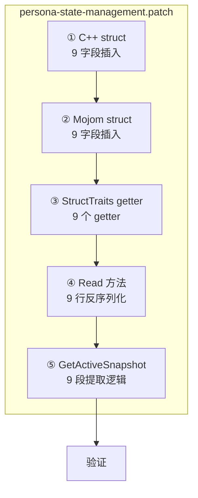

# 路线 A：完整补齐 Snapshot 缺失字段

## 事实纠正

经核查 patch 源码，`device` 和 `os` **已存在**于 `HeliumPersonaSnapshot` struct（`persona-state-management.patch:216-217`）、mojom（`:643-644`）、traits（`:357-363`）和 Read() 中。

测试 `MakeSeededPersona()` 引用但 struct 中**实际不存在**的字段为 **9 个**：

| # | 字段名 | C++ 类型 | 测试值 | Dict 路径（推测） |
|---|--------|---------|--------|-----------------|
| 1 | `gpu_driver` | `std::string` | `"31.0.101.5534"` | `persona["gpu"]["driver"]` |
| 2 | `refresh_rate` | `int` | `60` | `persona["screen"]["refreshRate"]` |
| 3 | `font_pack_name` | `std::string` | `"Windows 11 English"` | `persona["fonts"]["name"]` |
| 4 | `font_families` | `std::vector<std::string>` | `{"Arial", "Calibri", "Segoe UI"}` | `persona["fonts"]["families"]` |
| 5 | `font_aliases` | `std::vector<std::string>` | `{"sans-serif=Arial", ...}` | `persona["fonts"]["aliases"]` |
| 6 | `font_rendering_id` | `std::string` | `"windows-cleartype"` | `persona["fontRendering"]["id"]` |
| 7 | `font_antialiasing` | `bool` | `true` | `persona["fontRendering"]["antialiasing"]` |
| 8 | `font_subpixel_rendering` | `bool` | `true` | `persona["fontRendering"]["subpixelRendering"]` |
| 9 | `font_lcd_text` | `bool` | `true` | `persona["fontRendering"]["lcdText"]` |

## 修改文件

全部改动落在 **一个 patch**：`helium/patches/helium/core/persona-state-management.patch`

## 五层修改清单

每个字段需要同步修改 5 个位置：

```
① C++ struct 定义      (persona_snapshot.h, ~line 200-260)
② Mojom struct 定义     (persona_snapshot.mojom, ~line 630-690)
③ StructTraits getter  (persona_snapshot_mojom_traits.h, ~line 299-540)
④ StructTraits Read()  (persona_snapshot_mojom_traits.h, ~line 550-600)
⑤ GetActiveSnapshot()  (persona_service.cc, ~line 1522-1700)
```

---

### 字段 1：`gpu_driver` (string)

**① C++ struct** — 在 `webgpu_adapter` 之后插入：
```cpp
  std::string webgpu_adapter;
  std::string gpu_driver;          // ← 新增
  std::string font_pack_id;
```

**② Mojom struct** — 在 `webgpu_adapter` 之后插入：
```mojom
  string webgpu_adapter;
  string gpu_driver;               // ← 新增
  string font_pack_id;
```

**③ StructTraits getter** — 在 `webgpu_adapter` getter 之后插入：
```cpp
  static const std::string& gpu_driver(
      const ::blink::HeliumPersonaSnapshot& data) {
    return data.gpu_driver;
  }
```

**④ Read() 方法** — 在 `ReadWebgpuAdapter` 之后添加：
```cpp
       data.ReadWebgpuAdapter(&out->webgpu_adapter) &&
       data.ReadGpuDriver(&out->gpu_driver) &&       // ← 新增
       data.ReadFontPackId(&out->font_pack_id) &&
```

**⑤ GetActiveSnapshot()** — 在 `webgpu_adapter` 提取之后添加：
```cpp
  if (const std::string* value =
          FindNestedString(*persona, "gpu", "webgpuAdapter")) {
    snapshot.webgpu_adapter = *value;
  }
  if (const std::string* value =
          FindNestedString(*persona, "gpu", "driver")) {      // ← 新增
    snapshot.gpu_driver = *value;
  }
```

---

### 字段 2：`refresh_rate` (int)

**① C++ struct** — 在 `pixel_depth` 之后插入：
```cpp
  int pixel_depth = 0;
  int refresh_rate = 0;            // ← 新增
  double device_scale_factor = 0.0;
```

**② Mojom struct** — 在 `pixel_depth` 之后插入：
```mojom
  int32 pixel_depth;
  int32 refresh_rate;              // ← 新增
  double device_scale_factor;
```

**③ StructTraits getter** — 在 `pixel_depth` getter 之后插入：
```cpp
  static int refresh_rate(const ::blink::HeliumPersonaSnapshot& data) {
    return data.refresh_rate;
  }
```

**④ Read() 方法** — 在 `pixel_depth` 赋值之后添加：
```cpp
    out->pixel_depth = data.pixel_depth();
    out->refresh_rate = data.refresh_rate();       // ← 新增
    out->device_scale_factor = data.device_scale_factor();
```

**⑤ GetActiveSnapshot()** — 在 `device_scale_factor` 提取之后添加：
```cpp
  snapshot.device_scale_factor =
      FindNestedDouble(*persona, "screen", "deviceScaleFactor").value_or(0.0);
  snapshot.refresh_rate =                          // ← 新增
      FindNestedInt(*persona, "screen", "refreshRate").value_or(0);
```

---

### 字段 3：`font_pack_name` (string)

**① C++ struct** — 在 `font_pack_id` 之后插入：
```cpp
  std::string font_pack_id;
  std::string font_pack_name;      // ← 新增
  std::string font_rendering_engine;
```

**② Mojom struct** — 在 `font_pack_id` 之后插入：
```mojom
  string font_pack_id;
  string font_pack_name;           // ← 新增
  string font_rendering_engine;
```

**③ StructTraits getter** — 在 `font_pack_id` getter 之后插入：
```cpp
  static const std::string& font_pack_name(
      const ::blink::HeliumPersonaSnapshot& data) {
    return data.font_pack_name;
  }
```

**④ Read() 方法** — 在 `ReadFontPackId` 之后添加：
```cpp
       data.ReadFontPackId(&out->font_pack_id) &&
       data.ReadFontPackName(&out->font_pack_name) &&  // ← 新增
       data.ReadFontRenderingEngine(&out->font_rendering_engine) &&
```

**⑤ GetActiveSnapshot()** — 在 `font_pack_id` 提取之后添加：
```cpp
  if (const std::string* value = FindNestedString(*persona, "fonts", "id")) {
    snapshot.font_pack_id = *value;
  }
  if (const std::string* value =                 // ← 新增
          FindNestedString(*persona, "fonts", "name")) {
    snapshot.font_pack_name = *value;
  }
```

---

### 字段 4：`font_families` (vector\<string\>)

**① C++ struct** — 在 `navigator_languages` 之后插入（与其他 vector 字段一起）：
```cpp
  std::vector<std::string> navigator_languages;
  std::vector<std::string> font_families;     // ← 新增
  std::vector<HeliumPersonaUaChBrand> ua_ch_brands;
```

**② Mojom struct** — 在 `navigator_languages` 之后插入：
```mojom
  array<string> navigator_languages;
  array<string> font_families;               // ← 新增
  array<HeliumPersonaUaChBrand> ua_ch_brands;
```

**③ StructTraits getter** — 在 `navigator_languages` getter 之后插入：
```cpp
  static const std::vector<std::string>& font_families(
      const ::blink::HeliumPersonaSnapshot& data) {
    return data.font_families;
  }
```

**④ Read() 方法** — 在 `ReadNavigatorLanguages` 之后添加：
```cpp
       data.ReadNavigatorLanguages(&out->navigator_languages) &&
       data.ReadFontFamilies(&out->font_families) &&  // ← 新增
       data.ReadUaChBrands(&out->ua_ch_brands);
```

**⑤ GetActiveSnapshot()** — 在 `font_pack_id` / `font_pack_name` 提取之后添加：
```cpp
  const base::ListValue* font_families_list =            // ← 新增
      persona->FindPath({"fonts", "families"})
          ? persona->FindPath({"fonts", "families"})->GetIfList()
          : nullptr;
  if (font_families_list) {
    for (const auto& value : *font_families_list) {
      if (value.is_string()) {
        snapshot.font_families.push_back(value.GetString());
      }
    }
  }
```

> **注意**：`FindNestedString` 不适用于 list。需要直接用 `FindPath` + `GetIfList` 遍历。如果 persona dict 中没有 `FindPath` 的 helper，参照已有的 `ua_ch_form_factors` 提取模式（`persona-state-management.patch:1664-1673`）。

---

### 字段 5：`font_aliases` (vector\<string\>)

与 `font_families` 完全同构。

**① C++ struct**：
```cpp
  std::vector<std::string> font_families;
  std::vector<std::string> font_aliases;      // ← 新增
```

**② Mojom struct**：
```mojom
  array<string> font_families;
  array<string> font_aliases;                 // ← 新增
```

**③ StructTraits getter**：
```cpp
  static const std::vector<std::string>& font_aliases(
      const ::blink::HeliumPersonaSnapshot& data) {
    return data.font_aliases;
  }
```

**④ Read() 方法**：
```cpp
       data.ReadFontFamilies(&out->font_families) &&
       data.ReadFontAliases(&out->font_aliases) &&     // ← 新增
       data.ReadUaChBrands(&out->ua_ch_brands);
```

**⑤ GetActiveSnapshot()** — 参照 `font_families` 的 list 提取模式：
```cpp
  const base::ListValue* font_aliases_list =            // ← 新增
      persona->FindPath({"fonts", "aliases"})
          ? persona->FindPath({"fonts", "aliases"})->GetIfList()
          : nullptr;
  if (font_aliases_list) {
    for (const auto& value : *font_aliases_list) {
      if (value.is_string()) {
        snapshot.font_aliases.push_back(value.GetString());
      }
    }
  }
```

---

### 字段 6：`font_rendering_id` (string)

**① C++ struct** — 在 `font_rendering_engine` 之后插入：
```cpp
  std::string font_rendering_engine;
  std::string font_rendering_id;   // ← 新增
  std::string noise_seed;
```

**② Mojom struct**：
```mojom
  string font_rendering_engine;
  string font_rendering_id;        // ← 新增
  string noise_seed;
```

**③ StructTraits getter**：
```cpp
  static const std::string& font_rendering_id(
      const ::blink::HeliumPersonaSnapshot& data) {
    return data.font_rendering_id;
  }
```

**④ Read() 方法**：
```cpp
       data.ReadFontRenderingEngine(&out->font_rendering_engine) &&
       data.ReadFontRenderingId(&out->font_rendering_id) &&  // ← 新增
       data.ReadNoiseSeed(&out->noise_seed) &&
```

**⑤ GetActiveSnapshot()** — 在 `font_rendering_engine` 提取之后：
```cpp
  if (const std::string* value =
          FindNestedString(*persona, "fontRendering", "engine")) {
    snapshot.font_rendering_engine = *value;
  }
  if (const std::string* value =                 // ← 新增
          FindNestedString(*persona, "fontRendering", "id")) {
    snapshot.font_rendering_id = *value;
  }
```

---

### 字段 7-9：`font_antialiasing` / `font_subpixel_rendering` / `font_lcd_text` (bool ×3)

三个 bool 字段结构完全相同，可批量处理。

**① C++ struct** — 在 `font_metric_noise` 之后插入（与其他 bool 字段一起）：
```cpp
  bool font_metric_noise = false;
  bool font_antialiasing = false;           // ← 新增
  bool font_subpixel_rendering = false;     // ← 新增
  bool font_lcd_text = false;               // ← 新增
  std::string user_agent;
```

**② Mojom struct**：
```mojom
  bool font_metric_noise;
  bool font_antialiasing;                   // ← 新增
  bool font_subpixel_rendering;             // ← 新增
  bool font_lcd_text;                       // ← 新增
  string user_agent;
```

**③ StructTraits getter** ×3：
```cpp
  static bool font_antialiasing(const ::blink::HeliumPersonaSnapshot& data) {
    return data.font_antialiasing;
  }

  static bool font_subpixel_rendering(
      const ::blink::HeliumPersonaSnapshot& data) {
    return data.font_subpixel_rendering;
  }

  static bool font_lcd_text(const ::blink::HeliumPersonaSnapshot& data) {
    return data.font_lcd_text;
  }
```

**④ Read() 方法** — 在 `font_metric_noise` 赋值之后：
```cpp
    out->font_metric_noise = data.font_metric_noise();
    out->font_antialiasing = data.font_antialiasing();               // ← 新增
    out->font_subpixel_rendering = data.font_subpixel_rendering();   // ← 新增
    out->font_lcd_text = data.font_lcd_text();                       // ← 新增
    out->hardware_concurrency = data.hardware_concurrency();
```

**⑤ GetActiveSnapshot()** — 在 `font_rendering_engine` / `font_rendering_id` 提取之后：
```cpp
  snapshot.font_antialiasing =                              // ← 新增
      FindNestedBool(*persona, "fontRendering", "antialiasing").value_or(false);
  snapshot.font_subpixel_rendering =                        // ← 新增
      FindNestedBool(*persona, "fontRendering", "subpixelRendering").value_or(false);
  snapshot.font_lcd_text =                                  // ← 新增
      FindNestedBool(*persona, "fontRendering", "lcdText").value_or(false);
```

---

## 修改总览



| 层 | 插入点 | 新增行数（估计） |
|-----|--------|--------------|
| ① C++ struct | `webgpu_adapter` 后 / `pixel_depth` 后 / `font_pack_id` 后 / `font_rendering_engine` 后 / `font_metric_noise` 后 / `navigator_languages` 后 | ~12 行 |
| ② Mojom | 同上对应位置 | ~9 行 |
| ③ StructTraits getter | 同上对应位置 | ~30 行 |
| ④ Read() | bool 批量 + string 逐个 + vector 逐个 | ~12 行 |
| ⑤ GetActiveSnapshot() | GPU 1 段 / Screen 1 段 / Fonts 3 段 / FontRendering 4 段 | ~35 行 |
| **合计** | | **~98 行** |

## 验证

```bash
cd helium

# 1. Cheap validation
python3 .codex/skills/helium-validate/scripts/run_validation.py

# 2. Source-backed validation
python3 .codex/skills/helium-validate/scripts/run_validation.py \
    --with-source --source-tree chromium_src

# 3. Patch apply 验证
./devutils/validate_patches.py -l chromium_src -v
```

## 风险

| 风险 | 缓解 |
|------|------|
| `FindPath` API 在当前 Chromium 版本中签名不同 | 参照已有的 `ua_ch_form_factors` list 提取模式 |
| mojom 字段顺序影响序列化兼容性 | mojom 是按名称匹配的，字段顺序不影响 |
| `font_rendering_id` 与 `font_pack_id` 语义混淆 | 测试中两者值不同（`"windows-cleartype"` vs `"windows-11-en"`），确认为不同字段 |
| CreatePersona() 未写入这些字段 | 本计划只改 snapshot 层和读取层；CreatePersona 的 dict 补全可后续做，不影响测试编译 |
