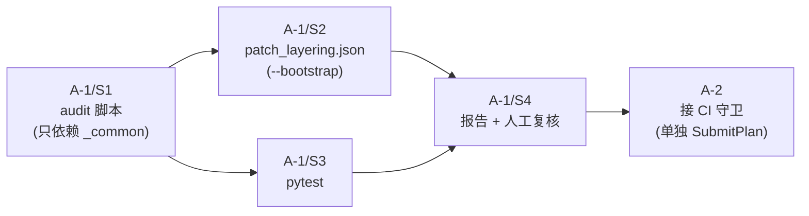

# 阶段 A 可执行计划（修正版）：补丁分层审计脚本 + 分级清单 + 报告

> 范围：**只新增审计工具与数据，不改任何现有补丁**。
> 本版已根据交叉验证修正 4 个阻塞点（见末尾「修正记录」）。
> 所有路径相对 `/Users/youtonghy/github/Project/Nitrous/helium`。

---

## 关键设计决策（已据交叉验证修正）

1. **清单用 JSON，且放在 `patches/` 之外** → `devutils/patch_layering.json`
   - 理由：`check_unused_patches()` 只扫 `patches_dir.rglob('*')` 且仅忽略 `.md`（`check_patch_files.py:31`）。放进 `patches/` 的任何非补丁文件都会被判 unused 而 fail。放到 `patches/` 之外彻底规避，**零改动现有忽略逻辑**。
   - JSON 是 stdlib（`import json`），**不引入 PyYAML**（CI `.cirrus_requirements.txt` 未含 PyYAML，repo 里 `import yaml` 全在构建树而非 devutils 本体）。
2. **audit 脚本只单向依赖 `utils/_common.py`**
   - 只 `from _common import parse_series, ENCODING, get_logger`，**绝不** import `check_patch_files`，避免与"守卫反向注册"形成循环导入。
3. **阶段 A 拆成 A-1 / A-2 两个交付**
   - A-1：脚本 + 测试 + 报告能力，**不接 CI 守卫**。
   - A-2：清单人工复核完成后，再接入 `validate_config.py` / `check_patch_files.py` 的强制守卫。
4. **`auto_level` 与 `declared_level` 分离**
   - 自动推断与人工判断各存一字段，互不覆盖；不一致时只作"复核信号"，不是硬错误。

---

## 交付物清单

| # | 文件 | 阶段 | 类型 | 说明 |
|---|------|------|------|------|
| 1 | `devutils/audit_patch_layering.py` | A-1 | 新增 | 审计引擎：解析 series → 推断 auto_level → 出报告 |
| 2 | `devutils/patch_layering.json` | A-1 | 新增 | 分级清单（JSON，`patches/` 之外） |
| 3 | `devutils/tests/test_audit_patch_layering.py` | A-1 | 新增 | pytest 单元测试 |
| 4 | `docs/patch-layering-report.md` | A-1 | 生成 | 审计报告（`--report` 产出） |
| 5 | `devutils/validate_config.py` | **A-2** | 改动 | 注册 `check_patch_layering_coverage` |
| 6 | `devutils/check_patch_files.py` | **A-2** | 改动 | `main()` 注册（与 validate_config 对齐） |

> A-1 与 A-2 **分两次 `SubmitPlan`**：A-1 跑通且清单人工复核后，才提交 A-2 接守卫。

---

## A-1 / Step 1 — 新增 `devutils/audit_patch_layering.py`

### 1.1 依赖（单向，无循环）

```python
import argparse, json, re, sys
from pathlib import Path
from third_party import unidiff

sys.path.insert(0, str(Path(__file__).resolve().parent.parent / 'utils'))
from _common import ENCODING, get_logger, parse_series  # 仅此一处跨模块依赖
sys.path.pop(0)
```

> 自带轻量 series→full-path 展开（复制 `_read_series_file` 的 3 行逻辑），**不** import `check_patch_files`。

### 1.2 分层语义：`auto_level` = 目录主导（脆弱度）+ 窄「配置面」覆盖

**核心定义**：`auto_level` 表示"升级时这个补丁有多容易碎"。规则分两类，**配置面覆盖优先于目录规则**：

#### (a) 配置面覆盖白名单（命中即定级，优先级最高）

这些是"真正的配置旋钮"，无论在哪个目录，改动都是低脆弱度：

| 匹配（对 `+++ b/<path>`） | level | 理由 |
|--------------------------|-------|------|
| 路径 == `flags.gn`（仓库自身 GN args） | 1 | 这就是配置文件本体 |
| `_features\.(cc\|h)$`（feature 默认值面） | 1 | 翻一行 `ENABLED/DISABLED_BY_DEFAULT` |
| `about_flags\.cc$` | 1 | flag 注册面 |
| `\.(grd\|grdp)$` | 0 | 资源/字符串 |
| `-Info\.plist$` | 0 | 打包元信息 |
| `(^\|/)(resources?\|theme\|branding)/` | 0 | 资源/品牌 |
| `prefs\.(cc\|h)$` 或 `browser_prefs` | 2 | 默认 pref 注册面 |

#### (b) 目录主导兜底（未命中配置面时）

按路径所属层定级。**注意：泛 `BUILD.gn` / `.gni` 不进配置面白名单**，按所在目录定级（修正发现 4）：

| 匹配 | level |
|------|-------|
| `^third_party/blink/` / `^v8/` / `^sandbox/` / `renderer/` | 5 |
| `^content/` / `^net/` / `^extensions/` / `^components/safe_browsing/` / `^google_apis/` | 4 |
| `^chrome/browser/ui/` / `^chrome/browser/resources/settings/` / `^components/policy/` | 2 |
| `^components/` / `^chrome/browser/` / `^services/` | 3 |
| 其它未命中 | 3（标 `unmapped=true` 供人工复核） |

**两个被点名的边界 case 的确定结果：**
- `content/BUILD.gn` → 泛 `.gn`，**不**进配置面 → 目录规则 `^content/` → **L4** ✓
- `components/safe_browsing/foo_features.cc` → 命中 `_features.cc$` 配置面 → **L1**（即"改这里只翻一行默认值"确实低脆弱）。若人工认为该 feature 在 safe_browsing 语境下实际很难降，则在清单里把 `declared_level` 设为 4 并写 `reason`——**auto 与 declared 不一致正是要暴露的复核点，不是错误**。

> 补丁 `auto_level` = 其所有 hunk 命中 level 的**最大值**（最脆弱层决定整体）。

### 1.3 核心函数

```python
def classify_patch(patch_path) -> dict:
    """-> {files:[...], hunk_count:N, auto_level:max, unmapped:bool}"""

def load_manifest(path=Path('devutils/patch_layering.json')) -> dict:
    """JSON: { slug: {auto_level, declared_level, target_level, kind, reason} }"""

def audit(patches_dir, series_path=Path('series')) -> list[dict]:
    """每补丁 classify + 合并 manifest 字段 -> 报表行"""

def render_report(rows, out_path): ...
```

### 1.4 CLI

```bash
# 自动推断并生成/刷新清单初稿（declared_level/target/kind 置 null，auto_level 自动填）
python3 devutils/audit_patch_layering.py --bootstrap

# 生成报告（不影响退出码）
python3 devutils/audit_patch_layering.py --report docs/patch-layering-report.md

# 守卫模式（A-2 才接入 CI；A-1 阶段可手动跑观察）
python3 devutils/audit_patch_layering.py --check
```

降级收益排序键：`(declared_level - target_level) * 100 + hunk_count`（无 declared 时退回 auto_level）。

---

## A-1 / Step 2 — `devutils/patch_layering.json`（清单，JSON）

字段按交叉验证建议设为五项，**自动与人工分离**：

```json
{
  "helium/core/prefer-https-by-default.patch": {
    "auto_level": 1,
    "declared_level": 1,
    "target_level": 1,
    "kind": "to-feature-flag",
    "reason": "已在 L1，确认能否收敛为单行 feature 默认值或 fieldtrial"
  },
  "helium/core/persona-state-management.patch": {
    "auto_level": 5,
    "declared_level": 5,
    "target_level": 5,
    "kind": "keep-as-patch",
    "reason": "注入新 mojom 接口 + 跨进程 snapshot，无法降级"
  }
}
```

- `auto_level`：脚本写，人工不改。
- `declared_level` / `target_level` / `kind` / `reason`：人工复核填。
- `kind` 合法值：`to-gn-flag` `to-feature-flag` `to-pref-default` `to-policy` `to-component` `to-resource` `keep-as-patch` `merge-candidate` `null`。
- **初始化**：`--bootstrap` 对 164 补丁填 `auto_level`，其余置 `null`。

---

## A-1 / Step 3 — 单元测试 `devutils/tests/test_audit_patch_layering.py`

对齐现有 `tests/test_check_patch_files.py` 风格，覆盖：

- `classify_patch`：构造含 `blink/`、`content/`、`flags.gn`、`content/BUILD.gn`、`_features.cc`、`resources/` 的假 diff，断言：
  - 多文件取最大 level
  - **`content/BUILD.gn` → L4**（泛 .gn 不进配置面）
  - **`components/safe_browsing/x_features.cc` → L1**（配置面覆盖）
  - `content/.../renderer/x.cc` → L5
- `load_manifest`：JSON round-trip。
- 报表排序键正确。

```bash
cd devutils && python3 -m pytest tests/test_audit_patch_layering.py -v
```

---

## A-1 / Step 4 — 生成报告 + 人工复核

```bash
python3 devutils/audit_patch_layering.py --bootstrap
python3 devutils/audit_patch_layering.py --report docs/patch-layering-report.md
```

报告含：Level 分布、降级候选（按收益排序）、keep-as-patch 清单、merge 候选、**unmapped 清单**、**auto≠declared 不一致清单**（复核重点）。

人工复核：对每个补丁填 `declared_level` / `target_level` / `kind` / `reason`。

---

## A-1 验证（不接 CI 守卫）

```bash
python -m yapf --style .style.yapf -e '*/third_party/*' -rpd devutils
cd devutils && python3 -m pytest tests/test_audit_patch_layering.py -v && cd ..
bash devutils/run_devutils_tests.sh
python3 .codex/skills/helium-validate/scripts/run_validation.py
```

> A-1 **不碰补丁、不碰源码树**，不需要 quilt / fresh-source / macOS 流程。

---

## A-2（清单复核完成后，单独提交）— 接入 CI 守卫

### `check_patch_layering_coverage(patches_dir)` 校验规则

只在以下情况 fail（其余仅作 report 提示，不阻塞）：

- series 中某补丁在清单中**缺条目** → fail
- 清单中某 slug **不在** series（多余/孤儿）→ fail
- 条目**缺 `declared_level`** → fail（强制人工定级）
- `kind == keep-as-patch` 但**缺 `reason`** → fail（强制书面理由）
- `declared_level` 越界（非 0–5）或 `kind` 非法 → fail
- `auto_level != declared_level` → **仅 warning（report），不 fail**（这是复核信号，不是错误）

### 注册（单向依赖：守卫文件 import audit，audit 不 import 它们）

```python
# devutils/validate_config.py  (main 内追加)
from audit_patch_layering import check_patch_layering_coverage
warnings |= check_patch_layering_coverage(patches_dir)

# devutils/check_patch_files.py (main 内追加)
from audit_patch_layering import check_patch_layering_coverage
warnings |= check_patch_layering_coverage(args.patches)
```

### A-2 验证

```bash
python -m yapf --style .style.yapf -e '*/third_party/*' -rpd devutils
cd devutils && python3 -m pytest -v && cd ..
python3 .codex/skills/helium-validate/scripts/run_validation.py --full
```

---

## 执行顺序



---

## 完成标准

**A-1：**
- [ ] 脚本对 164 补丁推断 `auto_level` 无崩溃
- [ ] `patch_layering.json` 在 `patches/` 之外，不触发 `check_unused_patches`
- [ ] pytest 全绿（含三个边界 case 断言），yapf 无 diff
- [ ] 报告生成，含 unmapped 与 auto≠declared 两个复核清单
- [ ] 清单全部条目人工填好 `declared_level`/`kind`/`reason`

**A-2：**
- [ ] 守卫按规则 fail/warn，`run_validation.py --full` 通过
- [ ] 无循环导入（`python3 -c "import audit_patch_layering"` 与守卫文件互不死锁）

---

## 修正记录（对应交叉验证四点）

| 发现 | 核实 | 本版修正 |
|------|------|---------|
| 阻塞1：layering.yaml 被当 unused | ✅ `_PATCHES_IGNORE_SUFFIXES={'.md'}`，rglob 全扫 patches/ | 清单移到 `devutils/patch_layering.json`（patches/ 之外），零改动忽略逻辑 |
| 阻塞2：循环导入 | ✅ 双向 import 成环 | audit 只依赖 `utils/_common`；守卫单向 import audit |
| 阻塞3：YAML 非 stdlib | ✅ CI reqs 无 PyYAML | 改用 JSON（stdlib `json`） |
| 正确性：分层优先级 | ✅ 目录优先会误判 content/BUILD.gn | 定义"配置面覆盖优先 + 目录兜底"；泛 .gn 走目录；auto≠declared 仅作复核信号 |
| 阶段拆分 | 采纳 | A-1（工具）/ A-2（守卫）分两次提交 |
| 字段设计 | 采纳 | auto_level/declared_level/target_level/kind/reason |

---

## 范围之外（留给阶段 B）

不改写任何 `.patch`、不动 series 条目、不动 flags.gn、不转 pref/feature、不同步 helium-macos。
