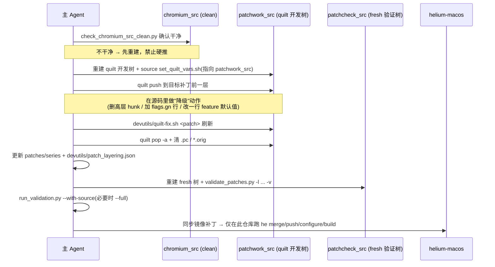

# 阶段 B + C 可执行计划（修正版）：补丁降级执行 + 长期治理

> 前置：**阶段 A（含 A-2 守卫）已跑通**，`devutils/patch_layering.json` 全部条目 `declared_level`/`kind`/`reason` 已人工确认。
> 所有路径相对 `/Users/youtonghy/github/Project/Nitrous/helium`，macOS 集成在 `/Users/youtonghy/github/Project/Nitrous/helium-macos`。
> 每个批次都是**独立的一次 `SubmitPlan`**，不要把多批次混在一个执行窗口里。

## 本版关键约束（据交叉验证修正）

1. **每批限 3–8 个补丁**——不按 `kind` 一次性全做。批次小 = 回滚面小、验证可控、问题可定位。
2. **每个补丁必须有「行为等价验证说明」**——写进该批的 changelog / `patch_layering.json` 的 `reason`。
3. **`to-feature-flag` / `to-policy` / `to-component` 不能只靠 fresh apply**——必须有运行期行为验证（实际 `he build` 出包冒烟，或等价的运行期断言）。
4. **清单文件是 `devutils/patch_layering.json`**（JSON，patches/ 之外），降级后同步更新 `declared_level`。

---

## 总览：批次顺序与依赖


**为什么是这个顺序**：先做"几乎不可能出错"的配置迁移建立信心和工具链，再逐步进入需要验证运行期行为的改动，最后才碰 persona 引擎类的高层补丁。每一批跑通后，下一批的风险认知和回滚经验都更充分。

---

## 贯穿所有批次的标准作业流程（SOP）

每个被降级的补丁都走这套动作。**这是 AGENTS.md 纪律的固化，不可跳步。**



### SOP 命令骨架

```bash
# 0. clean baseline
python3 devutils/check_chromium_src_clean.py --source-tree chromium_src
# 失败则重建：
# rm -rf chromium_src && python3 ./utils/downloads.py unpack -i downloads.ini -c chromium_download_cache chromium_src

# 1. 建独立 quilt 开发树
rm -rf codex_tmp/patchwork_src
python3 ./utils/downloads.py unpack -i downloads.ini -c chromium_download_cache codex_tmp/patchwork_src
source devutils/set_quilt_vars.sh      # 确认 QUILT_* 指向 patchwork_src，不是 chromium_src

# 2. push 到目标补丁前一层，编辑源码，刷新
quilt push <patch-before-target>
#   —— 仅在 codex_tmp/patchwork_src 内改源码 ——
./devutils/quilt-fix.sh <target-patch>

# 3. 清理开发树
quilt pop -a || true
find codex_tmp/patchwork_src -name '*.orig' -delete
rm -rf codex_tmp/patchwork_src/.pc

# 4. fresh source 验证
rm -rf codex_tmp/patchcheck_src
python3 ./utils/downloads.py unpack -i downloads.ini -c chromium_download_cache codex_tmp/patchcheck_src
python3 devutils/check_chromium_src_clean.py --source-tree codex_tmp/patchcheck_src
./devutils/validate_patches.py -l codex_tmp/patchcheck_src -v

# 5. 项目验证（含 layering 守卫）
python3 .codex/skills/helium-validate/scripts/run_validation.py --with-source --source-tree chromium_src
python3 .codex/skills/helium-validate/scripts/run_validation.py --full   # 影响面大时
```

### 每批通用收尾

- 更新 `devutils/patch_layering.json`：被降级补丁的 `declared_level` 改为新层；若整个补丁被删除，则从 `series` 和清单同步移除。
- 跑 `audit_patch_layering.py --report` 重新生成报告，确认"高层补丁数下降"。
- 同步 `helium-macos/helium-chromium/patches/` 镜像，最终 `he *` 仅在 macOS 仓库执行。

### 回滚预案（任一批次失败）

- fresh 验证或 `he push` 失败 → 视为污染，按 AGENTS.md：`rm -rf codex_tmp/patchwork_src codex_tmp/patchcheck_src`，必要时重建 `chromium_src`。
- 该批次补丁改动用 `git` 还原（`patches/` 与 `devutils/patch_layering.json`），回到批次开始前状态。
- 单个补丁降级失败但不影响其它 → 把该补丁 `kind` 标回 `keep-as-patch` 并在 note 写明失败原因，继续本批其余补丁。

---

## 阶段 B-1：GN flag / 资源迁移（风险最低）

**目标**：把报告里 `kind in {to-gn-flag, to-resource}` 的补丁，从源码 diff 迁到 `flags.gn` 或资源覆盖。

**为什么先做**：这类改动等价性最直观（一个开关 = 一个 GN arg），且 `flags.gn` 已是成熟出口，`check_gn_flags` 会自动校验排序/去重。

**逐补丁动作**：
1. 确认该补丁本质是"翻转一个已被 GN arg 暴露的开关"。用 `gn args --list` / 上游 `BUILD.gn` 确认 arg 名存在。
2. 走 SOP：删掉补丁中对应 hunk；若补丁因此变空 → 整个删除 + 移出 series。
3. 在 `flags.gn` 增加/修改对应行（**保持字母序、不重复**）。
4. fresh 验证 + `check_gn_flags` 必过。

**特殊纪律**：
- `flags.gn` 必须排序、不重复，否则 `validate_config.py` fail。
- 资源类（`to-resource`）改动确认走的是 Helium 的 `resources/` 覆盖机制，不是改 Chromium 源码 grd。

**B-1 完成标准**：所有 `to-gn-flag`/`to-resource` 候选已迁移或明确标注无法迁移；`flags.gn` 通过校验；报告中 L1 以下补丁数下降。

---

## 阶段 B-2：默认 pref 收纳（风险低）

**目标**：把 `kind == to-pref-default` 的散落补丁，集中收纳到 `inox-patchset/modify-default-prefs.patch` 风格的单一补丁中。

**为什么这样做**：把 N 个"各改一处默认值"的小补丁，合并成 1 个"集中设默认 pref"的补丁，**hunk 数和升级碎裂面同时下降**。

**逐补丁动作**：
1. 确认目标行为可由"注册时改默认 pref 值"实现（而非运行期逻辑判断）。
2. 走 SOP：在 `modify-default-prefs.patch`（或新建一个 `helium/core/helium-default-prefs.patch` 集中补丁）里追加 pref 默认值设置。
3. 删除原补丁中等价的逻辑 hunk；原补丁变空则移出 series。
4. 验证：fresh apply + 行为等价确认（pref 默认值正确）。

**注意**：
- `prefs.cc` 默认值改动属 L2，比原来动 `components/.../*.cc` 逻辑的 L3 更稳。
- 确认 pref 的 `RegisterProfilePrefs` / `RegisterLocalStatePrefs` 注册位置正确，否则默认值不生效。
- 合并补丁时确认无两个补丁覆盖同一段（AGENTS.md：避免重复覆盖）。

**B-2 完成标准**：`to-pref-default` 候选已收纳；集中补丁通过 fresh 验证；报告显示散补丁数下降、L3 补丁减少。

---

## 阶段 B-3：feature flag 默认值翻转（风险中）

**目标**：把 `kind == to-feature-flag` 的补丁，改成最小化的 `base::Feature` 默认值翻转（理想：单行改 `*_features.cc` 的 `FEATURE_ENABLED/DISABLED_BY_DEFAULT`；更理想：走 `fieldtrial_testing_config` 或启动参数，完全不碰源码）。

**为什么有风险**：`base::Feature` 默认值在不同 channel/平台可能不同；翻转后要确认运行期行为与原 patch 完全等价。

**逐补丁动作**：
1. 定位该功能对应的 `base::Feature` 定义（`grep` feature 名）。
2. 评估三种降级路径，优先级从高到低：
   - (a) `disable_fieldtrial_testing_config=true` 已在 `flags.gn` → 评估能否用 fieldtrial 配置（最干净）。
   - (b) 启动参数 `--enable-features` / `--disable-features` 注入默认（改启动逻辑一处）。
   - (c) 改 `*_features.cc` 默认值一行（仍是 patch，但从多 hunk 收敛到单行，L4/L3 → L1）。
3. 走 SOP，fresh 验证 + **运行期行为验证**（这一批必须实际确认行为，不能只看 patch apply 成功）。

**注意**：
- 上游若把该 feature 默认值跟平台绑定，翻转可能引入回归 → 谨慎，必要时标 `keep-as-patch`。
- 这一批建议在 `helium-macos` 实际 `he build` 出包后做一次冒烟，确认功能行为。

**B-3 完成标准**：feature 候选已翻转为最小改动；运行期行为经验证等价；报告显示 L4/L3 → L1 迁移。

---

## 阶段 B-4：component / policy 化（风险中高）

**目标**：
- `kind == to-component`：把"进二进制的功能"改成按需下发的 component（范本：`ublock-install-as-component.patch`）。
- `kind == to-policy`：把隐私/更新类开关改成 enterprise policy 默认/锁定。

**为什么风险更高**：涉及下发链路 / 策略加载链路，验证面比单纯配置大。

**逐补丁动作**：
1. component 路径：参照 `add-component-l10n-support` / `add-component-managed-schema-support` / `ublock-install-as-component` 的现有机制，确认下发与加载已就绪。
2. policy 路径：确认目标行为有对应 policy key，能用默认值/锁定表达。
3. 走 SOP，fresh 验证 + 下发/策略链路验证。

**注意**：
- component 化要确认离线/首启场景行为可接受（component 尚未下发时的 fallback）。
- 这一批可能引入新文件而非删 hunk，注意 series 顺序与 `check_unused_patches`。

**B-4 完成标准**：候选已 component/policy 化；链路验证通过；离线 fallback 已确认。

---

## 阶段 B-5：L5 → L3 复核（风险最高，目标是"控量"而非"清零"）

**目标**：复核所有 `kind == keep-as-patch` 的 L4/L5 补丁（主要是 persona 引擎类），逐个回答两个问题：
1. **能不能降到 L3？**（把 blink/content 钩子改成 service/component 层接口）
2. **如果不能，为什么必须是这层补丁？**（写进 `devutils/patch_layering.json` 的 `reason`，作为永久文档）

**重点对象**（阶段 A 已预判为 L5）：
- `persona-state-management.patch`（content/public + blink + mojom）
- `persona-background-worker-snapshot-propagation.patch`
- `persona-privacy-sandbox-runtime-gates.patch`
- `persona-contacts-background-fetch-runtime-gating.patch`
- `persona-accept-language-reducer-guard.patch`

**逐补丁动作**：
1. 分析该补丁的 blink/content hunk 是否**必须**在引擎层（例如注入新 mojom 接口、跨进程传播 snapshot → 通常无法降）。
2. 对"看似可上移"的部分（如某些 runtime gating 逻辑能否搬到 service 层）做可行性评估；可降的走 SOP 降到 L3。
3. 不可降的：在 `patch_layering.json` 的 `reason` 写明硬约束理由，并确认现有 `check_persona_*_coverage` token 守卫覆盖到位（**降级/改写时严禁误删被守卫的 token**，否则 `validate_config.py` fail）。

**注意**：
- persona 是 Helium 核心差异化能力，B-5 的成功标准是"**数量可控 + 每个都有书面理由**"，不是"补丁清零"。
- 这一批最容易碰 persona token 守卫，改任何 persona 补丁前先看 `check_patch_files.py` 里 `_PERSONA_*_GROUPS` 的 token 列表。

**B-5 完成标准**：每个 L4/L5 keep-as-patch 都有书面"为什么必须是补丁"；能降的已降到 L3；所有 persona token 守卫仍通过。

---

## 阶段 C：长期治理（让降级成为常态，而非一次性运动）

**目标**：把"补丁分层"固化进日常工作流和升级流程，防止补丁层级回退膨胀。

> **时机约束（据交叉验证修正）**：阶段 C 是 **B-1~B-5 全部跑通、证明流程成熟后**的文档化收尾工作。
> **不要过早改 AGENTS.md**——尚未验证成熟的流程一旦写成强约束，反而会绑死后续迭代。
> C 阶段先以 `docs/` 下的独立文档形式沉淀；只有当某条流程在多个批次中被反复验证有效后，才考虑提炼进 AGENTS.md。

### C1. 升级流程固化（先落 docs，暂不进 AGENTS.md）

在 **`docs/` 新增**"Chromium 升级时的补丁分层 SOP"（**不是**直接改 AGENTS.md）：
1. 升级前先跑 `audit_patch_layering.py --report`，记录基线（各 level 补丁数）。
2. 升级后 fresh apply，**优先修低层补丁**（L0/L1 几乎不碎），高层补丁碎裂时优先考虑"能否顺势降级"而非原地 refresh。
3. 升级完成后再跑一次报告，对比基线，确认高层补丁数没有反弹。

### C2. 准入门槛（已在阶段 A 建立，C 阶段强化）

- 新补丁进 `series` 必须同时进 `devutils/patch_layering.json`（守卫已强制）。
- **新增 L4/L5 补丁需要书面理由**（在 `patch_layering.json` 的 `reason` 中），review 时检查。
- 定期（如每次大版本升级）跑报告，把新冒出来的高层补丁拉进降级候选。

### C3. 指标看板

`audit_patch_layering.py --report` 持续产出趋势指标：
- 各 level 补丁数随版本变化曲线
- "高层补丁占比"（L4+L5 / 总数）作为健康度指标，目标是长期下降或持平
- 累计降级数 / 剩余降级候选数

### C4. 文档沉淀

- 把每个 `keep-as-patch` 的理由集中成一份"Helium 必要引擎补丁清单"，作为新人理解 Helium 与上游差异的入口。
- B-1~B-5 每批的降级经验（哪些能降、哪些坑）写成简短 changelog。

---

## 整体完成标准（Definition of Done）

- [ ] B-1~B-4 候选补丁已按报告降级或明确标注无法降级
- [ ] B-5 所有 L4/L5 keep-as-patch 都有书面理由，persona token 守卫全绿
- [ ] 每批都通过 fresh apply + `run_validation.py --full`；**B-3/B-4 额外有运行期行为验证**（`he build` 冒烟或等价运行期断言，不只 fresh apply）
- [ ] `helium-macos` 镜像已同步，最终产物在 macOS 仓库构建通过
- [ ] 报告显示"高层补丁占比"较阶段 A 基线下降
- [ ] 阶段 C 升级 SOP 与准入门槛**先落 `docs/`**；成熟后才考虑提炼进 AGENTS.md

---

## 提交节奏建议

| 提交 | 内容 | 模式 |
|------|------|------|
| 已提交 | 阶段 A（审计脚本 + 清单 + 报告） | 执行 |
| 下一个 | B-1（gn-flag/resource） | 报告定稿后单独 SubmitPlan |
| 之后 | B-2 → B-3 → B-4 → B-5 | 每批跑通后再提下一批 |
| 收尾 | 阶段 C（治理 + 文档，先落 docs；AGENTS.md 暂缓） | B 全跑通后单独 SubmitPlan |

> 不要把多批次塞进一个执行窗口。每批跑通、报告确认高层补丁数下降后，再提交下一批——这样每一步都可回滚、可审计。
